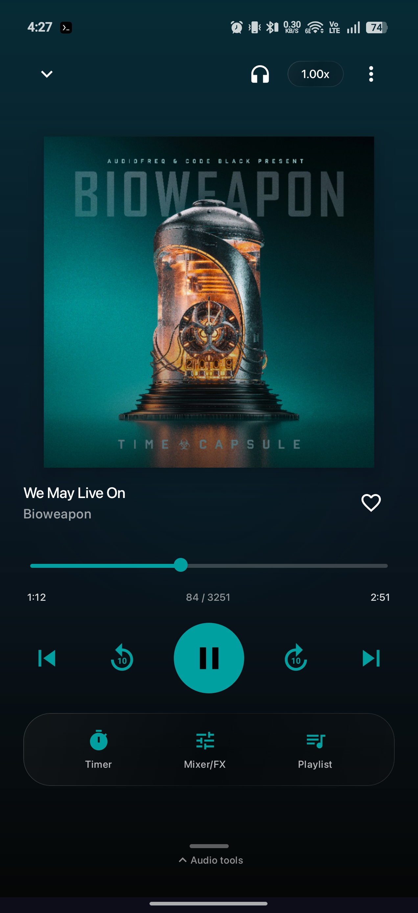
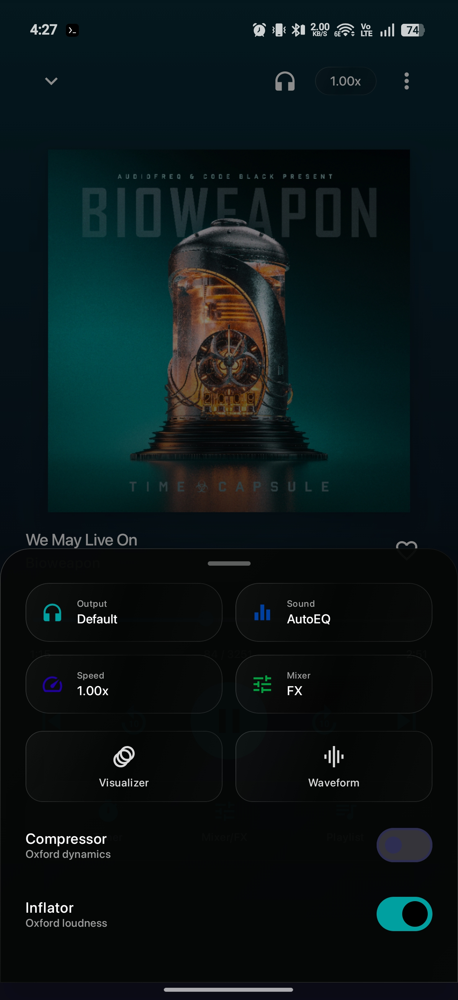

# Tryptify

> A native Android hi-fi audio player built around a from-scratch **C++17 DSP engine**, a headphone **AutoEQ** driven by real measurement data, and **bit-perfect USB-DAC output** over a USB Audio Class driver.

-3DDC84?logo=android&logoColor=white)


Tryptify is an audiophile-grade music player whose interesting parts live below the UI. A Jetpack Compose / Material 3 front end sits on top of a native signal-processing core: a 32-processor DSP mixing console, a parametric AutoEQ that synthesises correction filters from published headphone measurements, and a libusb-based driver that writes PCM directly to external DACs — bypassing the Android audio HAL for a bit-perfect path. It plays a local FLAC/lossless library, renders a real-time ProjectM visualizer off the post-DSP stream, and ships as a single installable app.

<sub>Formerly **MonoTrypT**. Application id and on-device storage are unchanged, so existing installs upgrade in place.</sub>

---

## Screenshots

| Now Playing | Audio tools |
| :---: | :---: |
|  |  |

| Library | AutoEQ |
| :---: | :---: |
|  |  |

| Compressor | Inflator |
| :---: | :---: |
|  | <br>|

| Settings | ProjectM Visualizer |
| :---: | :---: |
|  |  |

---

## Highlights

- **Native DSP mixing console** — 4 buses + master, **32 original C++ audio processors** (up to 16 per bus), ARM NEON SIMD, lock-free parameter updates between the UI and audio threads, true bypass when off.
- **Headphone AutoEQ** — a 10-band parametric generator that builds correction filters from **4,000+ frequency-response measurements** (squig.link + the AutoEq dataset), 10 target curves, measurement-rig–aware filtering, and custom CSV/TXT import.
- **Bit-perfect USB-DAC output** — a libusb **UAC1 + UAC2** driver that claims the streaming interface from the kernel and drives the isochronous endpoint directly, with asynchronous-feedback pacing and a watchdog fallback.
- **Local library** — MediaStore indexing with an embedded-tag reader, incremental sync, and a filesystem watcher; ReplayGain (track/album with peak protection), gapless playback, drag-to-reorder queue, variable speed.
- **Real-time visualizer** — a ProjectM OpenGL renderer tapping the post-DSP PCM, tinted by album-art color extraction.
- **Modern Android surface** — Compose + Material 3 throughout, a Glance home-screen widget, an Android Auto media browser, Chromecast via Media3 Cast, 16 themes plus live system dark-mode and dynamic album-art coloring.

---

## DSP Mixer

The core is a C++17 native library (`monochrome_dsp`) embedded inside the ExoPlayer audio pipeline. It uses ARM NEON SIMD, denormal flush-to-zero, and lock-free atomic state hand-off so the real-time audio thread never blocks on the UI.

```
ExoPlayer → ReplayGain → AutoEQ / ParamEQ → MixBusProcessor (JNI) → ProjectM tap → AudioSink
                                                  │                                    │
                                            Native DspEngine             ┌─────────────┴─────────────┐
                                            ├─ Bus 1  [up to 16 plugins] │  default → DefaultAudioSink
                                            ├─ Bus 2  [up to 16 plugins] │  bypass  → LibusbAudioSink
                                            ├─ Bus 3  [up to 16 plugins] │             (libusb UAC)
                                            ├─ Bus 4  [up to 16 plugins] └───────────────────────────┘
                                            ├─ Sum ──────────────────────┐
                                            └─ Master [up to 16 plugins] ┘
```

Each bus has gain (dB), pan, mute, solo, and input-enable. The master sums active buses, runs its own plugin chain, and meters the output with peak + hold ballistics. Engine state serialises to JSON and persists in Room. User-selectable processing block size (4096 / 8K / 16K).

### The 32 processors

| Category | Processors |
| --- | --- |
| **Utility** | Gain · Stereo (M/S + equal-power pan) · Channel Mixer (2×2 routing) · Haas |
| **EQ & Filter** | Filter (RBJ biquad: LP/BP/HP/Notch/Shelf/Peak, 1×–4× slope) · Comb · Formant · Ladder (Moog/diode, 2× OS) · Nonlinear (SVF + 5 shapers) · Resonator |
| **Dynamics** | Compressor · Limiter (5 ms lookahead, true peak) · Gate · Dynamics (dual-threshold) · Compactor (lookahead limiter/ducker) · Transient Shaper · Trance Gate (8-step ADSR) |
| **Distortion** | Distortion (6 modes) · Shaper (256-pt transfer LUT) · Bitcrush (SR + bit-depth, TPDF dither) · Phase Distortion (Hilbert self-PM) |
| **Modulation** | Chorus · Ensemble · Flanger (barberpole) · Phaser (2–12 stage) · Ring Mod · Tape Stop · Frequency Shifter (SSB via Hilbert pair) · Pitch Shifter (granular OLA) |
| **Space** | Delay (≤2 s, ping-pong, ducking) · Reverb (8-line FDN + 4 allpass diffusers) · Reverser |

Every processor exposes bypass, dry/wet, and 5 ms parameter smoothing. **All setters clamp their inputs and reject non-finite values before they reach the real-time thread**; biquads fall back to passthrough on pathological f/Q combinations rather than producing NaNs.

A separate **Inflator** and **Compressor** (Oxford/Seap-style) are exposed on their own screens, outside the bus plugin chain.

**Shared primitives:** RBJ-cookbook biquads, cubic-interpolated delay lines, peak/RMS envelope followers, LFOs, allpass chains, DC blocker, Hilbert transform, 2× half-band oversampler, lookahead buffers, Hann overlap-add crossfade, and exponential parameter smoothers.

---

## AutoEQ

A 10-band parametric EQ that generates headphone-correction filters from frequency-response measurements.

**Algorithm — greedy iterative peak-finding:**

1. Normalise the measurement against the target over the 250–2500 Hz midrange window.
2. Scan 20 Hz–16 kHz for the worst deviation (sub-50 Hz weighted 1.2×).
3. Invert that deviation as gain (clamped ±12 dB, ±8 dB above 8 kHz) and estimate Q from the bandwidth.
4. Subtract the new filter's biquad response from the remaining error.
5. Repeat up to 10 bands, stopping early once max error < 0.05 dB.

**Target curves:** Harman Over-Ear 2018 · Harman In-Ear 2019 · Diffuse Field · Knowles · Moondrop VDSF · Flat, plus several house targets.

**Measurement sources** — twelve squig.link instances are queried in parallel on first fetch and the published AutoEq catalog is bundled; per-source failures are silent so one dead host can't poison the list (24 h cache TTL). Each measurement is tagged by the **rig** it was captured on (B&K 5128, GRAS 43AG-7 / 43AC-10 / 45CA-10, IEC-711 clone, MiniDSP EARS, Uploaded, Unknown), and the picker re-filters by rig instantly with no network round-trip.

**Custom measurements** — CSV/TXT with auto-detected delimiter, header detection, and European-decimal handling; the imported curve is cached so it survives across sessions.

**Audio integration** — the EQ processor wraps Android's system `Equalizer` effect bound to the ExoPlayer session. Parametric bands are projected onto the device's fixed system bands with a Gaussian gain-estimation model, gains clamp to the hardware's millibel limits, and a preamp clamps against peak band gain to protect headroom. Updates are read via an atomic snapshot per audio block — no clicks during live tweaking.

---

## USB-DAC bit-perfect output

A libusb-backed Audio Class driver that takes the streaming interface from the kernel and writes PCM straight to the DAC's isochronous endpoint, bypassing the Android audio HAL.

**Owns:** one process-wide libusb context; a device handle wrapping a Java-supplied `UsbDeviceConnection` fd; streaming-interface alt-setting selection + claim (plus an AudioControl-interface claim so `SET_CUR` reaches the device); a preallocated pool of isochronous transfers; a single-producer/single-consumer ring buffer the audio thread fills and the iso-completion callback drains; and an event thread driving `libusb_handle_events`.

**Negotiates:** UAC1 *and* UAC2, auto-detected from the descriptors (UAC1 covers devices like the Focal Bathys that don't speak UAC2). Sample rate is resolved via the UAC2 clock entity and `GET_RANGE`, walking Selector → Source units as needed; alts whose max packet size can't fit the configured rate are rejected up front.

**Pacing:** a UAC2 asynchronous-feedback endpoint reader gives sample-accurate iso scheduling; UAC1 falls back to fixed-rate pacing.

**Sink integration:** `LibusbAudioSink` is a Media3 `ForwardingAudioSink` wrapping a `DefaultAudioSink`. When bypass is hot it runs the *same* `AudioProcessor` chain (mixer DSP, AutoEQ, parametric EQ, FFT spectrum, ProjectM tap) and then writes the post-DSP PCM to libusb. Software volume follows the hardware keys; pause silences the DAC instantly; a **watchdog with a short grace window falls back to the delegate sink if the iso pump wedges**.

**Failure surfacing:** start failures are categorised — *no-device, no-matching-alt, claim-failed, set-alt-failed, sample-rate-failed, iso-pump-alloc/submit-failed* — and surfaced to Settings as actionable text instead of one boilerplate string.

---

## Architecture

Single-module app, package `tf.monochrome.android`.

```
tf.monochrome.android/
├── audio/
│   ├── dsp/        # MixBusProcessor (JNI), DspEngineManager
│   │   └── oxford/ # Inflator + Compressor
│   ├── eq/         # AutoEqEngine, EqProcessor, FrequencyTargets
│   └── usb/        # LibusbUacDriver, LibusbAudioSink, exclusive controller
├── auto/           # Android Auto media browser
├── data/
│   ├── db/         # Room v8 (reactive Flow DAOs)
│   ├── downloads/  # WorkManager offline downloader
│   ├── local/      # MediaStore scanner + tag reader + fs watcher
│   └── preferences/# DataStore settings
├── di/             # Hilt modules
├── domain/         # Models + use cases (incl. MeasurementRig)
├── player/         # Media3 PlaybackService, QueueManager, StreamResolver, ReplayGain
├── ui/
│   ├── mixer/      # BusStrip, PluginSlot, PluginPicker, PluginEditor, DspCanvas
│   ├── eq/         # Parametric + AutoEQ screens, FrequencyResponseGraph, rig chips
│   ├── oxford/     # Inflator + Compressor screens
│   └── theme/      # Color schemes, Dimens, DynamicColorExtractor
├── visualizer/     # ProjectM OpenGL renderer + JNI audio tap
└── widget/         # Glance Now Playing widget
```

### Native code

```
app/src/main/cpp/
├── dsp/
│   ├── dsp_engine.{h,cpp}   # Bus / plugin routing, metering, state serialization
│   ├── dsp_jni.cpp          # Kotlin ↔ C++ bridge
│   ├── snapins/             # 32 processor implementations + AutoEq biquad chains
│   └── util/                # Shared DSP primitives
├── usb/
│   ├── libusb_uac_driver.{h,cpp}  # UAC1 + UAC2 streaming driver
│   └── usb_jni.cpp                # Kotlin ↔ libusb bridge
├── projectm_bridge.{h,cpp}        # ProjectM visualizer wrapper
└── audio_ring_buffer.{h,cpp}
```

Built with `-O3 -ffast-math`, NEON SIMD, denormal flush-to-zero. ABIs: `arm64-v8a`, `armeabi-v7a`, `x86_64`, with an explicit `libc++_shared` runtime.

### Persistence

Room v8 with reactive `Flow<T>` DAOs for favorites, history, play events, playlists, downloads, cached lyrics, and EQ/mix presets. App settings (output mode, EQ state, theme) live in DataStore.

---

## Tech stack

| Component | Version |
| --- | --- |
| Language | Kotlin 2.1.0 |
| DSP engine | C++17 via JNI (`monochrome_dsp`) |
| USB driver | libusb 1.0 (UAC1 + UAC2) |
| UI | Jetpack Compose · Material 3 (BOM 2024.12.01) |
| Audio | Media3 / ExoPlayer 1.5.1 |
| Casting | Media3 Cast · Google Cast 22.0.0 |
| Visualizer | ProjectM 4.1.6 (C++17 via JNI) |
| Images | Coil 3.0.4 |

---

## Building

**Requirements:** Android Studio (Ladybug or newer), JDK 17, and the Android NDK + CMake (installed via the SDK Manager). The native dependencies (libusb, ProjectM) are vendored as git submodules under `third_party/`.

```bash
# clone with submodules
git clone --recursive https://github.com/tryptz/Tryptify.git
cd Tryptify
# or, if already cloned:
git submodule update --init --recursive

# debug build
./gradlew assembleDebug

# install on a connected device
./gradlew installDebug
```

For release builds, copy `keystore.properties.example` to `keystore.properties` and fill in your signing config. Prebuilt APKs are on the [Releases page](https://github.com/tryptz/Tryptify/releases/latest) (Android 8.0+, sideload or `adb install`).

> On a fresh install the visualizer assets load on first launch (usually a few seconds) — if Android shows an ANR dialog, choose **Wait**.

---

## Reliability & diagnostics

A few deliberate choices keep a real-time audio app from failing silently on real hardware:

- **Real-time safety** — every DSP setter clamps its range and rejects non-finite input before the audio thread sees it; biquads degrade to passthrough on bad coefficients instead of emitting NaNs.
- **Bypass watchdog** — if the USB iso pump stalls, a watchdog with a short grace window automatically falls back to the standard Android audio sink so playback never dead-ends.
- **Categorised errors** — USB start-up failures map to specific, actionable causes surfaced in Settings rather than a generic message.
- **Source isolation** — optional/secondary subsystems are wrapped so a single failure (a dead measurement host, a missing tag) is logged and dropped without taking down playback.

---

## Author

Built by **[tryptz](https://github.com/tryptz)** — self-taught Android / audio-systems developer (Kotlin · Jetpack Compose · C++/JNI DSP).
