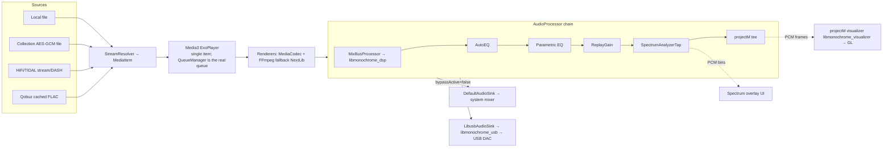
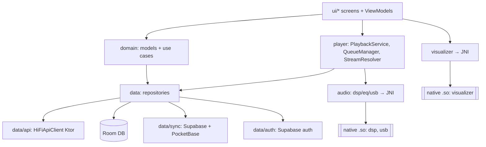

# Tryptify — Codebase Map & Audit

> A deep, audiophile-grade Android music player and visualizer. Streams from self-hosted TIDAL-/Qobuz-style "HiFi" backends, indexes on-device audio, and renders a native projectM (MilkDrop) GL visualizer. Includes a parametric/AutoEQ equalizer, a node-based DSP mixer, native USB-Audio-Class bit-perfect output, encrypted "collections", cloud sync, and Android Auto / car mode.

**Document status:** Generated 2026-06-28 by a multi-agent codebase audit. Subsystems marked **[deep audit]** received a full agent deep-read of their source; subsystems marked **[focused pass]** were documented from a single targeted read (the multi-agent run was interrupted by a session usage cap before those agents and the four cross-cutting agents finished). Every claim below is grounded in files actually read; `file:line` citations are from the audited reads. Re-run the deep audit on the [focused pass] subsystems to reach full depth.

---

## Executive summary

Tryptify (internal name **Monochrome**, applicationId `tf.monotrypt.android`, Kotlin namespace `tf.monochrome.android`, v1.6.2 / versionCode 162) is a single-module Android app of ~57,000 lines of Kotlin across 259 files, plus three native C++ engines reached over JNI. It is unusually deep for an Android app: it ships its own **SIMD DSP engine**, a **libusb USB-Audio-Class isochronous driver**, and the **projectM** MilkDrop visualizer, all built from source via CMake/NDK alongside a modern Compose/MVVM/Hilt Kotlin layer.

Top takeaways:

1. **Engineering ambition is high and the modern Android stack is used well** — Compose + Material3, Hilt, Room, Media3 (+ FFmpeg via NextLib), Coil3, WorkManager, Glance, a performance-tier system that sizes thread pools and caches per device, and a baseline profile. The native integration (three `.so` targets, a custom AudioProcessor chain, a bit-perfect USB path) is genuinely sophisticated.
2. **There are zero automated tests.** For ~57k lines with native JNI boundaries, real-time audio, and two streaming backends, this is the single largest risk to the codebase's maintainability.
3. **Several "load-bearing but fragile" couplings exist that an editor will break if unaware** — dual playback drivers that must be hand-synced, same-process singleton sharing between the UI and the playback service, a native `DEBUG_POSTFIX=""` hack so `System.loadLibrary` names match, and unstable Room ids regenerated on every local scan.
4. **Security is "client-app normal" but has rough edges** — a hardcoded Supabase **anon** JWT in source, a `security-crypto` dependency declared "for collection encryption keys" that is not actually wired (collection keys arrive as server-provided base64), `allowBackup=true` with auth tokens present, and stubbed Last.fm scrobbling.
5. **A meaningful amount of dead/half-wired code** — an unwired real-time file watcher, an unreachable measurement-upload screen, a non-functional car-mode EQ, two coexisting cloud backends (Supabase + PocketBase) suggesting an in-flight migration, and a removed bottom-nav left as scaffolding.

Overall health: **a strong, feature-rich app with solid architecture bones, held back by a total absence of tests and a backlog of half-finished/dead features that blur the source of truth in a few subsystems.**

---

## Tech stack & versions

| Area | Choice | Version |
|---|---|---|
| Language | Kotlin | 2.1.0 (KSP 2.1.0-1.0.29), Java/JVM target 17 |
| Build | Android Gradle Plugin | 9.0.0 (CMake 3.22.1, NDK 29.0.14206865) |
| SDK | min / compile / target | 26 / 36 / 36 |
| UI | Jetpack Compose (BOM) + Material3 | BOM 2024.12.01 |
| DI | Hilt (Dagger) | 2.57.1 |
| Local DB | Room | 2.7.1 |
| Networking | Ktor (OkHttp engine) | 3.0.3 |
| Playback | Media3 (ExoPlayer/Session/Cast) | 1.5.1 |
| Extra codecs | NextLib FFmpeg Media3 extension | 0.8.4 (DSD, APE, TAK, WavPack, TrueHD, DTS…) |
| Images | Coil3 | 3.0.4 |
| Cloud | Supabase (auth, postgrest, compose-auth) | BOM 3.4.1 |
| Background | WorkManager (+ hilt-work) | 2.10.0 |
| Prefs | DataStore Preferences | 1.1.1 |
| Widgets | Glance (AppWidget + Material3) | 1.1.1 |
| Async | kotlinx-coroutines / serialization | 1.9.0 / 1.7.3 |
| Color | AndroidX Palette | 1.0.0 |
| Cast | Google Cast framework | 22.0.0 |
| Auth | Credential Manager + Google ID | 1.5.0-beta01 / 1.1.1 |
| Perms | Accompanist Permissions | 0.36.0 |
| Glass FX | Haze (glassmorphism blur) | 1.7.1 |
| Startup | ProfileInstaller (baseline profile) | 1.4.1 |
| Native libs | projectM visualizer / libusb | submodules (v4.1.6 / master) |

Dependency notes: `credentials 1.5.0-beta01` is a pre-release pin. The Compose BOM (2024.12) trails the Kotlin 2.1.0 / AGP 9.0.0 pairing somewhat; verify Compose-compiler compatibility on AGP upgrades. The native FFmpeg extension is an LGPL build.

---

## Repository layout

```
Tryptify/
├── app/                                    # the single Gradle module (:app)
│   ├── build.gradle.kts                    # app build config, signing, NDK/CMake, deps
│   ├── monotrypt-debug.keystore            # COMMITTED debug keystore (shared signature)
│   ├── proguard-rules.pro                  # R8 rules (release isMinify + shrinkResources)
│   ├── baseline-prof.txt                   # AOT-compiled hot paths (ProfileInstaller)
│   └── src/main/
│       ├── AndroidManifest.xml             # components, permissions, deep links
│       ├── assets/
│       │   ├── presets/                    # ← submodule: MilkDrop presets (19k .milk files)
│       │   ├── projectm/                   # projectM runtime assets/presets
│       │   └── autoeq/targets/             # AutoEQ target response curves
│       ├── cpp/                            # native C++ (CMake)
│       │   ├── CMakeLists.txt              # builds 3 shared libs + vendored libusb static
│       │   ├── projectm_bridge.cpp/_jni.cpp/audio_ring_buffer.cpp   → libmonochrome_visualizer.so
│       │   ├── dsp/ (dsp_engine, dsp_jni, oxford/, snapins/, util/) → libmonochrome_dsp.so
│       │   └── usb/ (usb_jni, libusb_uac_driver)                    → libmonochrome_usb.so
│       ├── res/                            # Compose-era resources; xml/ has file_paths,
│       │                                   #   automotive_app_desc, widget info (no net-sec-config)
│       └── java/tf/monochrome/android/     # all Kotlin (see Subsystems below)
│           ├── MonochromeApp.kt            # @HiltAndroidApp entry; perf bootstrap
│           ├── ui/                         # Compose screens + ViewModels (MVVM)
│           ├── data/                       # repositories, api, db, sync, auth, collections…
│           ├── domain/                     # shared models + use cases
│           ├── audio/                      # dsp / eq / usb (Kotlin side of native audio)
│           ├── player/                     # Media3 playback service + queue + resolver
│           ├── visualizer/                 # projectM Kotlin bridge + GL view
│           ├── di/                         # 6 Hilt modules (graph also extended elsewhere)
│           ├── devedit/                    # in-app live layout editor overlay
│           └── performance/, debug/, widget/, auto/, share/, util/, util…
├── third_party/
│   ├── projectm/                           # ← submodule (branch v4.1.6)
│   └── libusb/                             # ← submodule (branch master)
├── gradle/libs.versions.toml               # version catalog (single source of dep versions)
├── settings.gradle.kts                     # rootProject.name = "Monochrome"; include(":app")
├── keystore.properties.example             # template for OPT-IN release signing
└── docs/ (projectm-android-integration.md, supabase/, screenshots/)
```

`third_party/**` and `app/src/main/assets/presets/**` are **vendored git submodules** — do not edit them as if they were app source.

---

## Build & native build

**Module structure:** one Gradle module, `:app`. Root project name is `Monochrome` (unrelated to the user-facing "Tryptify" brand).

**Commands (copy-paste):**
```bash
git submodule update --init --recursive   # MANDATORY — native build + visualizer break without it
./gradlew assembleDebug                    # debug APK (signed with committed debug keystore)
./gradlew installDebug                     # build + install to device/emulator
./gradlew assembleRelease                  # release APK (unsigned unless keystore.properties set)
./gradlew lint                             # static analysis (no unit/instrumented tests exist)
```
There is no meaningful test task — the project has **zero** `test`/`androidTest` sources.

**Signing model:**
- **Debug** uses the committed `app/monotrypt-debug.keystore` (store/key password `monotrypt`, alias `monotrypt-debug`). It is committed *on purpose* so every machine and CI run produce the same signature and `installDebug` upgrades in place instead of failing on a signature mismatch.
- **Release** is **opt-in**: it activates only when a complete `keystore.properties` (storeFile/storePassword/keyAlias/keyPassword) exists at repo root. Absent that file, `assembleRelease` still builds but emits an unsigned APK, and all other tasks work normally.

**Native build (CMake → NDK 29, CMake 3.22.1):** `app/src/main/cpp/CMakeLists.txt` produces three shared libraries plus a statically-linked libusb:

| Native lib | Sources | Links | Loaded by (Kotlin) |
|---|---|---|---|
| `libmonochrome_visualizer.so` | `projectm_bridge.cpp`, `projectm_jni.cpp`, `audio_ring_buffer.cpp` + projectM subproject | `EGL`, `GLESv3`, `projectM`, `projectM_playlist`, `log` | `ProjectMNativeBridge` |
| `libmonochrome_dsp.so` | `dsp/dsp_engine.cpp`, `dsp/dsp_jni.cpp`, `dsp/oxford/oxford_jni.cpp` | `log` (`-O3 -ffast-math -fno-exceptions -fno-rtti`, NEON on arm64) | `DspNativeLoader` (`MixBusProcessor`, Oxford `*Native`) |
| `libmonochrome_usb.so` | `usb/usb_jni.cpp`, `usb/libusb_uac_driver.cpp` + `usb1.0` static | `log` | `UsbNativeLoader` (`LibusbUacDriver`) |

ABIs built: `arm64-v8a`, `armeabi-v7a`, `x86_64`. The projectM subproject is added via `add_subdirectory` pointing at `third_party/projectm`. libusb upstream sources are listed directly in CMake (bypassing its autotools build) and compiled into a static `usb1.0` that is embedded into `libmonochrome_usb.so`.

**Known build gotchas:**
- **Submodules are required.** A fresh clone without `git submodule update --init --recursive` will fail the native build (missing `third_party/projectm`, `third_party/libusb`) and ship a visualizer with no presets.
- **`DEBUG_POSTFIX` is forced to `""`** on `projectM`, `projectM_playlist`, `monochrome_dsp`, and `monochrome_visualizer`. Without it, debug builds would emit `libprojectM-4d.so` etc., and `System.loadLibrary("projectM-4")` would fail with a scary `dlopen failed` on every debug launch. Don't remove this.
- **AGP 9.0 specifics in `gradle.properties`:** `android.builtInKotlin=false` (use the explicit Kotlin plugin) and `android.newDsl=false`. `nonTransitiveRClass=true`.
- **On arm64 proot build hosts** the APK build needs a static `aapt2` (lzhiyong) override in `~/.gradle/gradle.properties` (environment-specific, not a repo concern).
- `local.properties` must point `sdk.dir` at the Android SDK.

---

## Architecture overview

**Layering.** A conventional, mostly-disciplined `data` → `domain` → `ui` split:
- `ui/<feature>/` — Compose screens + `@HiltViewModel` ViewModels exposing `StateFlow` UI state (MVVM). The player flattens ~30 flows into a single `MainPlayerUiState` so the layout composable stays stateless.
- `domain/` — shared models (`Track`/`Album`/`Artist`/`UnifiedTrack`, `PlaybackSource` sealed class) and use cases (`ResolvePlaybackUseCase`, `CrossSourceMatcher`, `DiscoveryFeedUseCase`).
- `data/` — repositories, the Ktor `HiFiApiClient`, Room DB + DAOs, sync, auth, collections, downloads, preferences.
- `audio/`, `player/`, `visualizer/` — the audio + native engines, sitting beside the data layer.

**DI.** Hilt with `@HiltAndroidApp` on `MonochromeApp`. Six modules under `di/` (`AppModule`, `ApiModule`, `DatabaseModule`, `NetworkModule`, `DspModule`, `PerformanceModule`), **plus two feature modules outside `di/`** (`data/collections/di/CollectionModule`, `data/local/di/LocalMediaModule`). The central `di/` folder is therefore *not* the whole graph.

**Same-process coupling is load-bearing.** `QueueManager`, `UnifiedTrackRegistry`, `StreamResolver`, and the audio `AudioProcessor`s are `@Singleton`s shared between the UI and `PlaybackService` because the `<service>` has **no `android:process`**. Introducing a separate service process would silently break queue/registry sharing.

### Audio signal chain (end-to-end)



Notes that matter for editing this path:
- **Two playback drivers.** In-app play is driven by `PlayerViewModel` through a Media3 `MediaController` (`resolveAndPlay → mc.setMediaItem/prepare/play`). `PlaybackService.playQueue()/playTrack()` only run for auto-advance (`STATE_ENDED`) and notification/Bluetooth/Auto skips. **Both resolve streams independently and must be kept in sync** — they already diverge on DASH, Qobuz synthesis, and preloading.
- **ExoPlayer holds one item at a time;** `QueueManager` (`@Singleton`) is the source of truth, and `QueueForwardingPlayer` re-routes lock-screen/notification next/prev back through it. So `onMediaItemTransition` reason is *always* `PLAYLIST_CHANGED` during normal playback (which is why the now-playing/history hook there is effectively dead).
- **The same singleton processor chain is handed to both `DefaultAudioSink` and `LibusbAudioSink`;** only one drains it at a time, gated by `bypassActive`. The projectM tap is deliberately omitted from the libusb chain because its bus can block the renderer thread. Player `volume`/ReplayGain is mirrored to `BypassVolumeController` because the USB path skips `DefaultAudioSink` where `Player.volume` is normally applied.

### Module / layer dependencies



---

## Subsystems

### app-shell / DI / navigation **[deep audit]**

The app bootstrap and shell: the Hilt `Application` (`MonochromeApp`), the single `MainActivity`, the Compose navigation root (`MonochromeNavHost` + `CatalogNav` helpers), and the `di/` modules. `MonochromeApp` resolves a device `PerformanceProfile` at class-load, configures WorkManager/Coil, warms native libs, and wires Supabase auth + device registration. `MainActivity` installs the splash screen, forces max refresh rate, intercepts volume keys for the libusb bypass path, and hosts one Compose tree (theme + DevEdit overlay + nav host).

| Key file | Role |
|---|---|
| `MonochromeApp.kt` | `@HiltAndroidApp`, `Configuration.Provider` (HiltWorkerFactory), `SingletonImageLoader.Factory` (Coil), perf bootstrap |
| `ui/main/MainActivity.kt` | sole `@AndroidEntryPoint` Activity; splash; deep-link/OAuth handling; volume-key bypass |
| `ui/navigation/MonochromeNavHost.kt` | hybrid HorizontalPager (Home/Library) + NavHost (all other screens) + mini-player + download pill |
| `di/` | `AppModule`, `ApiModule`, `DatabaseModule`, `NetworkModule`, `DspModule`, `PerformanceModule` |

Notable patterns: **static performance bootstrap** — `MonochromeApp` companion `init` sets `kotlinx.coroutines.scheduler.{core,max}.pool.size` via `System.setProperty` during class load (the scheduler reads these exactly once, before first dispatch); changing this ordering silently breaks thread-pool sizing. **Hybrid pager+NavHost** — the two tabs are a HorizontalPager while their NavHost destinations are empty stubs; a single `rememberSaveableStateHolder` keyed by route preserves tab state. **DevEdit wrapping** — every destination is wrapped in `DevEditScreen("<name>")`; adding a screen means adding the wrapper. **Notification channel coupling** — `PLAYBACK_CHANNEL_ID = "default_channel_id"` is hardcoded to match Media3's internal default channel id.

Findings: Room `fallbackToDestructiveMigration` with no migrations (schema bump wipes all local data); cold-start deep links dropped (handled only in `onNewIntent`); Supabase auth initialized twice; `allowBackup=true` with tokens/encrypted collections present; dead bottom-nav scaffolding; DI graph split across packages.

### playback-engine **[deep audit]**

Wraps a single Media3 ExoPlayer inside `PlaybackService` (a `MediaSessionService`), driving the custom AudioProcessor chain and the optional libusb sink, with FFmpeg fallback decoders from NextLib. `StreamResolver` maps four `PlaybackSource` types (LocalFile, CollectionDirect, HiFiApi/TIDAL, QobuzCached) plus a legacy `Track` path to `MediaItem`s, including an ISRC-based TIDAL→Qobuz fallback.

| Key file | Role |
|---|---|
| `player/PlaybackService.kt` | builds player/renderers/sink chain/MediaSession; auto-advance + media-button resolution |
| `player/StreamResolver.kt` | `PlaybackSource` → `MediaItem`; DASH special-casing; ISRC cross-source fallback |
| `player/QueueManager.kt` | `@Singleton` source-of-truth queue (ExoPlayer holds one item) |
| `player/QueueForwardingPlayer.kt` | routes notification/lock-screen next/prev back through QueueManager |

Findings: **DASH (TIDAL hi-res) fails on direct in-app selection** (URI-less MediaItem rebuilt only in the service's legacy branch); `updateNowPlaying()` effectively never called; ReplayGain not applied to local/collection/Qobuz; `onPlaybackResumption` batch-resolves the *entire* queue (network + possible full Qobuz downloads); `preloadNextTracks` resolves then discards; two divergent resolution paths; up to 120s hi-res buffered with `targetBufferBytes` unset.

### player-ui (Now-Playing + Car Mode) **[deep audit]**

`PlayerViewModel` is the single Hilt controller — it binds a `MediaController` to `PlaybackService`, mirrors playback state, and exposes track/queue/lyrics/visualizer/EQ/download flows. `MainPlayerRoute` collects ~30 flows into a `MainPlayerUiState` and delegates to the pure `MainPlayerScreen`. The hero slot crossfades album art, a progress ring, a live spectrum overlay, an in-player projectM visualizer (via `AndroidView`), and synced/karaoke lyrics.

Notable patterns: album-derived theming via `androidx.palette` (256×256, hardware-bitmap off, on `Dispatchers.Default`); reference-counted `SpectrumAnalyzerTap.acquire/release` and `ProjectMAudioBus.acquire/release` (forgetting the release leaks the analyzer); per-frame `Canvas` invalidation via `withFrameNanos` + a tick `mutableIntStateOf` with no per-frame allocation; lyrics auto-scroll via `derivedStateOf` firing once per line.

Findings: **Car Mode graphic EQ is non-functional** (never applied to audio); `CarModeScreen` spawns a *second* `PlayerViewModel`; `MediaController` connection has no retry despite a comment claiming one; `PlayerViewModel.progress` is a broken/dead StateFlow; dead pre-redesign composables (`ModePill`, `QueueHero`); two divergent synced-lyrics implementations.

### hifi-api-data **[deep audit]**

Talks to **two** user-configured, self-hosted streaming backends — a TIDAL-style "HiFi" API and a Qobuz-style "trypt-hifi" API — through one Ktor client (`HiFiApiClient`, ~1,254 lines), wrapped by `MusicRepository`, with `InstanceManager` resolving endpoints purely from saved preferences. The two backends use separate numeric id namespaces; `QobuzIdRegistry` is the persistent router that records which ids are Qobuz and maps a Qobuz numeric album id to the alphanumeric slug its detail endpoint needs.

Notable patterns: **no authentication anywhere** — `HiFiApiClient` attaches no token on any request; security relies entirely on the user-supplied instance URL (a 401 is treated as a generic failure → rotate instance). **Two id namespaces** — any new surface producing Qobuz `Track`s *must* call `registry.registerTrack/registerAlbum` or playback/lyrics/navigation mis-routes to TIDAL. **Qobuz playback is whole-file prefetch** — `/api/download-music` is HMAC-signed (time-bounded `etsp`), so `QobuzStreamCacheManager` downloads the entire FLAC up front. **TIDAL manifest parsing is three-way** (base64 `<MPD>` for DASH, JSON `urls`, or regex scrape).

Findings: negative caching (a transient parse failure caches an empty search for 30 min); no app-level timeout on TIDAL `fetchWithRetry`, four sequential sub-searches; per-key lock removed while waiters remain (double-fetch race); `slug.hashCode().toLong()` id fallback risks 32-bit collisions; Qobuz ReplayGain parsed but never mapped; over-defensive Qobuz envelope parsing because the real field name was never confirmed.

### local-library **[deep audit]**

Indexes on-device audio into Room and renders it. `MediaStoreSource` enumerates audio (`IS_MUSIC=1`, duration ≥ 30 s), `TagReader` reads tags + artwork via `MediaMetadataRetriever` (with sidecar/folder-cover fallback), and `MediaScanner` persists `LocalTrackEntity` rows then fully rebuilds album/artist/genre/folder groupings in one Room transaction. Scanning is **manual only** (refresh/add-folder); the `FileObserver` watcher and incremental-scan path exist but are unwired.

Notable patterns: a **single Room DB holds both the HiFi-catalog cache and all local tables**; groupings are fully torn down and rebuilt every scan, so `@PrimaryKey(autoGenerate=true)` album/artist ids are **not stable across scans** (stable identity is the internal `groupingKey`, but navigation uses the volatile id); synthetic "unknown" buckets are refused cover art; rich self-healing re-read triggers (`artworkMissing`, `derivableArtist`) mean the refresh button always uses `fullScan`.

Findings: **`deleteTracksNotIn` binds every track path as a SQL variable** → overflows SQLite's variable limit on large libraries (high); album/artist ids regenerated each scan break navigation/saved refs; excluded-paths plumbed end-to-end but never supplied; `FileObserverService` + incremental scan are dead code; ReplayGain/R128/ISRC/MusicBrainz/lyrics/comment never populated for local tracks; `FolderBrowserScreen` creates a fresh `StateFlow` per recomposition.

### eq-ui **[deep audit]**

The Compose front end for **two distinct equalizer surfaces** plus the Oxford mastering panel. The AutoEQ surface (`EqualizerScreen` + `EqViewModel`, ~1,021 lines) loads headphone frequency-response measurements from a remote AutoEq/squig.link database (or user uploads), runs AutoEQ against a selectable target curve, and renders an interactive FabFilter-style `FrequencyResponseGraph` with draggable band dots. The Parametric surface (`ParametricEqScreen/EditScreen`) is a free-form tone shaper with a live FFT overlay. The Oxford screens drive native Inflator/Compressor DSP with faders and LED meters.

Notable patterns: the **two EQ surfaces have independent state** (`eq*` vs `paramEq*` prefs, separate repositories) and share only the graph + `EqLimits` — edits in one do not reflect in the other. `FrequencyResponseGraph` is multi-mode (measurement vs parametric, different drag clamps `AUTOEQ_MAX_BAND_DB=12` / `PARAMETRIC_MAX_BAND_DB=24`). Restore-on-init deliberately uses `Flow.first()` (the older `stateIn(...).value` raced).

Findings: graph band hit-test position differs from the drawn dot; `saveCustomTargets` still uses the racy `stateIn(...).value`; `MeasurementUploadScreen` ("Advanced Calibration") is unreachable; "Export EQ" is a no-op; `ui/eq/SpectrumAnalyzer.kt` is entirely dead (the real analyzer is `audio.eq.SpectrumAnalyzerTap`); hardcoded ±12 literals instead of `EqLimits` constants; Oxford runs a 60 Hz meter-poll for both effects regardless of visible tab.

### audio-dsp-native **[focused pass]**

The Kotlin DSP layer plus the native engine. `DspEngineManager` and `MixBusProcessor` (the JVM façade) drive `libmonochrome_dsp.so` via `DspNativeLoader`. The JNI surface is rich and bus/slot-oriented:

- **`MixBusProcessor` native API:** `nativeCreate`/`nativeDestroy`/`nativeReconfigure`, `nativeProcess(handle, ByteBuffer, frames, channels)`, `nativeAddPlugin/RemovePlugin/MovePlugin`, `nativeSetParameter`, per-bus `nativeSetBusGain/Pan/Mute/Solo/InputEnabled`, `nativeSetMixBypassed`, `nativeSetPluginBypassed/DryWet`, metering (`nativeGetBusLevels`, `nativeGetAndResetClipped`), and full state round-trip via `nativeGetStateJson`/`nativeLoadStateJson`.
- **Oxford effects** are two separate native classes — `oxford.CompressorNative` and `oxford.InflatorNative` — each with `nativeCreate/Prepare/Process/ProcessArrays/SetParams/ReadMeters` (compressor also `nativeGainReductionDb`). Compiled `-O3 -ffast-math -fno-exceptions -fno-rtti`, NEON on arm64.

Snap-in plugin types are enumerated in `SnapinType`/`SnapinCategory`. `MixBusProcessor` is the same processor wired into the playback chain. *(Documented from signatures + CMake; a deep read of `dsp_engine.cpp`/snapins is recommended to fully characterize the algorithms and the audio-thread allocation/locking behavior.)*

### mixer **[focused pass]**

A node-/FL-Studio-style mixer UI over the native mix bus. `MixerViewModel` holds the graph; `ParamDef`/`FLColors`/`FLPluginColors` describe plugin parameters and the visual palette. The UI is substantial (`MixerScreen`, `MixerPage`, `PluginEditorSheet` ~663 lines, `InsertRack` ~491, plus `canvas/` nodes/connections/model, `panel/`, `macro/`). The visual graph maps onto the `MixBusProcessor` bus/slot/plugin model described above (each canvas node ↔ a native bus or insert slot; parameter edits call `nativeSetParameter`). *(Deep read recommended to document the canvas↔native-state synchronization and undo/redo, if any.)*

### visualizer **[focused pass]**

projectM (MilkDrop) integration. `ProjectMEngineRepository` owns the engine lifecycle; `ProjectMNativeBridge` is the JNI surface; `ProjectMRendererView`/`VisualizerRenderer` host GL rendering; `ProjectMAudioBus`/`ProjectMAudioTapProcessor`/`ProjectMAudioFrame` feed PCM via the native `audio_ring_buffer.cpp`; `ProjectMPresetCatalog`/`ProjectMAssetInstaller`/`InstalledProjectMAssets` manage the (submodule) preset library.

JNI surface (handle-based): `nativeCreate/Release/Resize/RenderFrame(frameTimeNanos)`, `nativePushPcm(samples, channelCount, sampleRate)`, preset control (`nativeSetPreset(path)`, `nativeNextPreset`, `nativeSetPresetDuration`, `nativeSetPresetShuffleEnabled`), and quality/feel knobs (`nativeSetFps`, `nativeSetQuality(meshWidth, meshHeight)`, `nativeSetBeatSensitivity`, `nativeSetBrightness`, `nativeSetPaused`) plus touch (`nativeTouch`, `nativeTouchDestroy`). See `docs/projectm-android-integration.md`. *(Deep read recommended for the GL thread model and ring-buffer back-pressure.)*

### usb-audio **[focused pass]**

USB-Audio-Class (UAC) bit-perfect direct output, the app's audiophile centerpiece. `LibusbAudioSink` is the Media3 `AudioSink` implementation; `LibusbUacDriver` is the JNI bridge to `libmonochrome_usb.so` (`UsbNativeLoader` loads it). Supporting classes: `UsbExclusiveController` (claims the device for exclusive access), `BypassVolumeController` + `BypassDiagnostics` (the "bypass" path that routes around the Android mixer; volume keys are hijacked in `MainActivity` while streaming), `AudioProcessorChain`, `ClockRateRange`, and `Status`/`StartError`/`StartFailure` result types.

JNI surface: `nativeInit`, `nativeOpen(fd)` (opens the USB device from an Android-granted file descriptor), `nativeStart(sampleRate, bitsPerSample, channels)`/`nativeStop`/`nativeClose`, format probing (`nativeSupportedRates`, `nativeIsStreamingFormat`, `nativeActiveStream`), the iso pump state (`nativeIsStreaming`, `nativePendingFrames`, `nativePlayedFrames`, `nativeFlushRing`), and error detail (`nativeLastErrorCode`, `nativeLastErrorDetail`). The isochronous transfer pump lives in `libusb_uac_driver.cpp`. *(Deep read recommended for xrun/latency behavior and the iso transfer threading.)*

### auth-sync-cloud-ai **[focused pass]**

Authentication, cloud sync, scrobbling, and AI. **Two cloud backends coexist:** `SupabaseAuthManager`/`AuthRepository` handle auth (Google sign-in via Credential Manager; `SharedPrefsCodeVerifierCache` for PKCE), `SupabaseSyncRepository` uses `postgrest`, while `SyncManager` + `PocketBaseClient` push a JSON blob of library/playlists to PocketBase user fields — a strong sign of an in-flight backend migration. The Supabase row models (`SbFavoriteTrack`, `SbPlaylist`, `SbPlayEvent`, `SbEqPreset`, `SbMixPreset`, …) enumerate what syncs. AI: `GeminiClient` calls Google Gemini using a **user-supplied** API key (from DataStore), with `AudioSnippetFetcher` providing audio context. Scrobbling: `ScrobblingService` targets Last.fm/ListenBrainz but is **stubbed with dummy credentials**.

### downloads-collections-share **[focused pass]**

`DownloadManager` + a WorkManager `DownloadWorker` (with `ActiveDownload`/`DownloadMeta`/`DownloadStatus`/`TrackDownloadState`) handle offline downloads and a global progress pill. **Collections** are an encrypted, server-distributed music feature: a `ManifestParser` reads a manifest, `AesGcmDecryptor` (AES-256-GCM, 12-byte IV + 128-bit tag) decrypts content, and `DecryptingDataSource` is a Media3 datasource that decrypts on the fly during playback; `CollectionRepository` + `CollectionDao`/`CollectionEntities` persist them. `TrackShareHelper` + the manifest `FileProvider` (`${applicationId}.fileprovider`, `file_paths.xml`) back the per-track "Share file" action. Note: decryption keys arrive as **base64 strings from the manifest/server**, not from the Android Keystore (see Security).

### settings / preferences / stats / home / search **[focused pass]**

`PreferencesManager` (~948 lines) is the central DataStore wrapper — a very large single preferences surface (audio output mode `SourceMode`, EQ namespaces, Gemini key, sync, performance, theming…). `SettingsScreen` (~1,988 lines, the largest file in the app) + `SettingsViewModel` render it. `StatsViewModel`/`ListeningStatsViewModel` + `StatsScreen` show listening stats over a `StatsRange`. `HomeViewModel`/`HomeScreen` is the discovery dashboard; `SearchViewModel` + `SearchUi` (with `SearchSourceFilter`/`SearchTypeFilter`/`RecommendationRow`) provide multi-source search — though note the app-shell audit found the search route currently unreachable.

### platform-integrations (theme, components, widget, auto, devedit, debug, performance, util) **[focused pass]**

The cross-app glue. **Theme:** `DynamicColorExtractor`/`DynamicPalette`/`MonoDimens` + `Theme.kt` provide album-art-driven Material theming. **DevEdit:** an in-app live layout editor (`DevEditController`/`DevEditRepository`/`DevEditLayout`/`ElementOverride`/`FreeformBox`) — every screen/section is wrapped with stable string ids; a shipped default layout is force-applied to users via versioned dev edits. **Widget:** `NowPlayingWidget` (Glance) + `NowPlayingWidgetReceiver`. **Android Auto:** `MonochromeMediaBrowserService` (a `MediaBrowserService` with play-from-search). **Performance:** `DeviceCapabilities`/`DeviceTier`/`DeviceSnapshot`/`PerformanceProfile` tier the device and feed thread-pool + cache sizing. **Debug:** `CrashLogger` + `DebugLog*` in-app log buffer. **util:** `RomajiConverter` (Japanese romanization for search/sort).

---

## Cross-cutting concerns

> The four dedicated cross-cutting agents (security, build/deps, architecture, performance) did not complete before the session cap. The findings below are synthesized from the six deep subsystem audits plus a direct read of the security-/build-critical files. Treat as substantial but not exhaustive.

### Security & privacy

- **Hardcoded Supabase anon JWT** in `data/auth/SupabaseAuthManager.kt:58` (project ref `lvzorvfhhopillzlwgau`, role `anon`, `exp` 2089). Anon keys are *designed* to be shippable behind Row-Level-Security, so this is acceptable **iff** RLS is enforced server-side — but it is committed to source and effectively un-rotatable without a release. **Action: confirm RLS on every table; plan for key rotation.**
- **`security-crypto` is declared "for collection encryption keys" but appears unused** — no `MasterKey`/`EncryptedSharedPreferences`/`EncryptedFile` references exist in Kotlin. Collection keys are handled as plain base64 from the server manifest (`AesGcmDecryptor.decryptBase64`, `DecryptingDataSource`). The crypto itself (AES-256-GCM, random IV, 128-bit tag) is textbook-correct, but `decryptUrl` **swallows all exceptions and returns the input as plaintext** on failure, which can mask tampering. **Action: either wire keystore-backed key storage or drop the dependency + comment; reconsider the silent-fallback in `decryptUrl`.**
- **`android:allowBackup=true`** while auth tokens and encrypted-collection state live in app storage — cloud/adb backup could exfiltrate them. **Action: set `allowBackup=false` or define a `fullBackupContent`/`dataExtractionRules` excluding secrets.**
- **Last.fm scrobbling is stubbed** with `LASTFM_API_KEY = "dummy_api_key"` / `"dummy_secret"` (`data/scrobbling/ScrobblingService.kt`) — non-functional, not a leak, but misleading.
- **Gemini API key is correctly user-supplied** via DataStore (`GEMINI_API_KEY`), passed as a query param to the Gemini endpoint — no embedded key. Good.
- **HiFi backends are fully unauthenticated** by design (user supplies the instance URL). Acceptable for a self-hosted model; document it so it isn't "fixed" accidentally.
- Cleartext is globally disabled (`usesCleartextTraffic="false"`); there is **no** `network_security_config.xml`, so all `http://` is blocked app-wide (verify the self-hosted instances are HTTPS). `FileProvider` is `exported=false` with scoped `file_paths.xml`. Exported components (`MainActivity`, `PlaybackService`, `MonochromeMediaBrowserService`, widget receiver) are the expected media-app set.

### Performance & concurrency

Strengths: per-device `PerformanceProfile` scales thread pools and Coil cache; a baseline profile AOT-compiles hot Compose paths; spectrum/visualizer overlays render per-frame via `withFrameNanos` with zero per-frame allocation; album-color extraction is off the main thread. Concerns surfaced by the audits: `onPlaybackResumption` batch-resolves the *entire* queue (network + possible full Qobuz file downloads) on a cold play tap; `preloadNextTracks` resolves and discards two tracks; up to 120 s of hi-res audio buffered with `targetBufferBytes` unset; `FolderBrowserScreen` allocates a fresh `StateFlow` per recomposition; Oxford polls meters at 60 Hz for both effects regardless of the visible tab; the HiFi `LruCache` is bounded by entry count, not memory. On the audio thread, the native DSP path is `-O3`/NEON and exception-free, but the audio-thread allocation/locking behavior of the snap-ins and the USB iso pump was not deep-audited — recommend a dedicated pass.

### Architecture & code quality

Strengths: clean `data`/`domain`/`ui` layering, consistent MVVM with `StateFlow`, a shared unified domain model across two streaming backends, and disciplined `@Singleton` sharing for the audio/queue state. Concerns: **god files** — `SettingsScreen.kt` (1,988), `HiFiApiClient.kt` (1,254, two backends in one class), `EqViewModel.kt` (1,021), `PreferencesManager.kt` (948); **two coexisting cloud backends** (Supabase + PocketBase) with no single documented source of truth; **routing correctness depends on side-effectful registry population** (`QobuzIdRegistry`) with no choke point; **dual playback drivers** that must be hand-synced; and a notable amount of **dead/half-wired code** (file watcher, measurement upload, car-mode EQ, search route, `ReplayGainProcessor.calculateVolumeUnified`). And, overarching everything, **zero tests**.

### Build & dependencies

Mostly current and coherent. Watch items: `credentials 1.5.0-beta01` is a pre-release pin; the native build hard-depends on three submodules and the `DEBUG_POSTFIX` hack; `fallbackToDestructiveMigration` means any Room schema bump is a data-loss event in production; ProGuard/R8 is on for release with `isMinifyEnabled`/`isShrinkResources` — verify keep-rules cover Ktor/kotlinx-serialization/Room/Supabase reflective paths (a deep proguard review was not completed).

---

## Risk register

Aggregated medium-and-above findings (deduplicated; sorted by severity). "Area" links to the subsystem section above.

| # | Severity | Area | Issue | File(s) | Recommendation |
|---|---|---|---|---|---|
| 1 | **High** | local-library | `deleteTracksNotIn` binds every track path as a SQL variable → exceeds SQLite's ~999 var limit, crashes on large libraries | `data/local/db/LocalMediaDao.kt` | Chunk the delete, or delete-by-set-difference in Kotlin / temp table |
| 2 | **High** | player-ui | Car Mode graphic EQ is a UI shell never applied to audio | `ui/carmode/CarModeViewModel.kt` | Wire to `EqRepository`/DSP or remove the controls |
| 3 | High→Med | Security | Hardcoded Supabase anon JWT in source (un-rotatable without release) | `data/auth/SupabaseAuthManager.kt:58` | Confirm RLS on all tables; plan rotation; consider remote config |
| 4 | Medium | playback | DASH (TIDAL hi-res) fails on direct in-app selection (URI-less MediaItem only rebuilt in service legacy branch) | `player/StreamResolver.kt`, `player/PlaybackService.kt` | Rebuild the DASH source in `PlayerViewModel.resolveAndPlay` too |
| 5 | Medium | playback | ReplayGain not applied to local/collection/Qobuz tracks (impl exists, unused) | `player/ReplayGainProcessor.kt` | Call `calculateVolumeUnified` on those paths |
| 6 | Medium | playback | `onPlaybackResumption` batch-resolves the entire queue (network + full Qobuz downloads) | `player/PlaybackService.kt` | Resolve only the resumed item; lazy-resolve the rest |
| 7 | Medium | playback | `updateNowPlaying()` (scrobble now-playing) effectively never called | `player/PlaybackService.kt` | Drive now-playing off `MediaController` state, not `onMediaItemTransition` |
| 8 | Medium | local-library | Album/artist ids regenerated every scan → broken navigation & saved refs | `data/local/scanner/MediaScanner.kt` | Upsert on stable `groupingKey`/normalized name |
| 9 | Medium | local-library | `excludedPaths` plumbed end-to-end but never supplied from prefs | `ui/library/LocalLibraryViewModel.kt` | Connect the stored preference |
| 10 | Medium | local-library | `FileObserverService` + incremental scan are dead → library stale until manual refresh | `data/local/watcher/FileObserverService.kt` | Wire the watcher or remove it |
| 11 | Medium | local-library | ReplayGain/R128/ISRC/MusicBrainz/lyrics never populated for local tracks | `data/local/tags/TagReader.kt` | Add a richer tag parser (e.g. JAudioTagger) |
| 12 | Medium | local-library | `FolderBrowserScreen` creates a fresh `StateFlow` per recomposition | `ui/library/FolderBrowserScreen.kt` | `remember` the flow |
| 13 | Medium | hifi | Negative caching: a transient parse failure caches an empty search for 30 min | `data/api/HiFiApiClient.kt` | Don't cache failures; cache only successful non-empty results |
| 14 | Medium | hifi | No app-level timeout on TIDAL `fetchWithRetry`; 4 sub-searches run sequentially | `data/api/HiFiApiClient.kt` | Add request timeout; parallelize sub-searches |
| 15 | Medium | app-shell | Room uses `fallbackToDestructiveMigration` → schema bump wipes all local data | `di/DatabaseModule.kt` | Add real migrations before any schema change |
| 16 | Medium | app-shell | Cold-start deep links (App Link + OAuth callback) dropped (only `onNewIntent` handled) | `ui/main/MainActivity.kt` | Factor a single handler called from `onCreate` + `onNewIntent` |
| 17 | Medium | eq-ui | `FrequencyResponseGraph` band hit-test position differs from the drawn dot | `ui/eq/FrequencyResponseGraph.kt` | Use the corrected-curve Y for hit-testing too |
| 18 | Medium | eq-ui | `saveCustomTargets` uses the documented-racy `stateIn(...).value` read | `ui/eq/EqViewModel.kt` | Switch to `Flow.first()` like the rest of the VM |
| 19 | Medium | eq-ui | `MeasurementUploadScreen` ("Advanced Calibration") is unreachable | `ui/eq/EqualizerScreen.kt` | Restore the trigger or remove the screen + paste flow |
| 20 | Medium | player-ui | `CarModeScreen` spawns a second `PlayerViewModel` instance | `ui/carmode/CarModeScreen.kt` | Pass the shared instance down |
| 21 | Medium | player-ui | `MediaController` connection has no retry despite a comment claiming one | `ui/player/PlayerViewModel.kt` | Add real reconnect/backoff |
| 22 | Medium | Security | `security-crypto` declared "for collection keys" but unused; `decryptUrl` silently returns plaintext on failure | `data/collections/crypto/AesGcmDecryptor.kt` | Wire keystore-backed key storage or drop the dep; reconsider silent fallback |
| 23 | Medium | Security | `allowBackup=true` with auth tokens + encrypted-collection state present | `AndroidManifest.xml` | `allowBackup=false` or exclude secrets via backup rules |
| 24 | Medium | Architecture | Two cloud backends (Supabase + PocketBase) coexist with no documented source of truth | `data/sync/*` | Decide the canonical backend; remove the other |

Plus the project-wide risk: **no automated tests** (see below).

---

## Testing gap

The project has **zero** `test`/`androidTest` sources. The highest-value first tests, ordered by risk × tractability:

1. **`StreamResolver` / `ResolvePlaybackUseCase`** — pure-ish mapping of `PlaybackSource` → `MediaItem`, including the DASH and ISRC-fallback branches (catches #4). Easy to unit-test with fakes.
2. **`QobuzIdRegistry` routing** — the correctness of every Qobuz playback path depends on it; test register/lookup/slug-mapping and round-trip through DataStore.
3. **`MediaScanner` grouping** — `groupingKey` stability, synthetic-bucket suppression, artist-from-title recovery (catches #8). Use an in-memory Room DB.
4. **`AesGcmDecryptor`** — encrypt/decrypt round-trip, tampered-tag rejection, the `decryptUrl` fallback behavior (catches #22).
5. **`HiFiApiClient` parsing** — feed captured JSON fixtures through the lenient decoder to lock the model defaults and the `unwrapResponse` envelope handling (catches the `{"data": null}` bug).
6. **`LocalMediaDao.deleteTracksNotIn`** — a Robolectric/instrumented test with > 1,000 paths reproduces #1.
7. A minimal **JNI smoke test** (instrumented) that loads each `.so` and calls `nativeCreate`/`nativeDestroy` to catch native ABI/loader regressions in CI.

Adding even a small JUnit + Robolectric harness around the data/domain layer would de-risk the most bug-dense subsystems.

---

## Recommendations

**P0 — correctness / data-loss / crashes**
- Fix #1 (`deleteTracksNotIn` SQL-variable overflow) — a real crash on large libraries.
- Add real Room migrations and stop relying on `fallbackToDestructiveMigration` (#15) before the next schema change.
- Fix #4 (DASH hi-res playback) and stabilize local navigation ids (#8).
- Confirm Supabase RLS and plan anon-key rotation (#3); decide the canonical sync backend (#24).

**P1 — high-value features that are silently broken / misleading**
- Wire or remove: Car Mode EQ (#2), the file watcher / incremental scan (#10), the measurement-upload screen (#19), Last.fm scrobbling, and `ReplayGainProcessor` (#5).
- Address negative caching + search timeouts in `HiFiApiClient` (#13, #14).
- Tighten backup security (#23) and the collection-key story (#22).

**P2 — maintainability**
- Split the god files (`SettingsScreen`, `HiFiApiClient`, `EqViewModel`, `PreferencesManager`); separate the TIDAL and Qobuz clients.
- Collapse the **two playback drivers** into one resolution path (or document the split rigorously).
- Introduce a unit-test harness (see Testing gap) and delete the dead code (`ModePill`, `QueueHero`, `ui/eq/SpectrumAnalyzer.kt`, dead VM methods, removed bottom-nav scaffolding).

---

## Open questions

- Is Supabase **or** PocketBase the intended cloud backend going forward, and is the other mid-removal? (`data/sync` ships both.)
- Is the `security-crypto` dependency intended to back collection-key storage, or is it vestigial? Where do collection decryption keys actually originate and how are they protected at rest?
- Are the self-hosted HiFi/Qobuz instances guaranteed HTTPS (given cleartext is globally disabled and there is no per-domain net-sec-config)?
- What is the intended status of the unreachable **search** route and the **car-mode EQ** — ship, or cut?
- The Qobuz `/api/download-music` field name was "never confirmed" per inline comments — is there a real API spec to narrow the over-defensive parsing against?
- **[focused-pass subsystems]** The native DSP snap-ins, the projectM GL/ring-buffer model, and the USB iso pump were documented from signatures + CMake, not a full read — a deep audit pass on `audio-dsp-native`, `visualizer`, and `usb-audio` is owed to characterize their audio-thread/real-time behavior.
