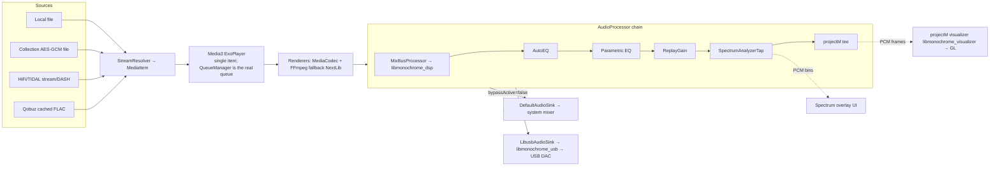
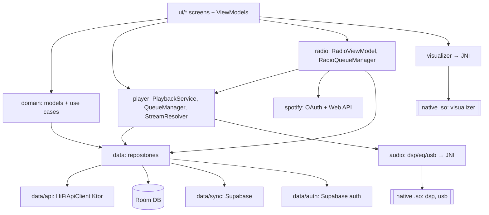

# Tryptify — Codebase Map & Audit

> A deep, audiophile-grade Android music player and visualizer. Streams from self-hosted TIDAL-/Qobuz-style "HiFi" backends, indexes on-device audio, and renders a native projectM (MilkDrop) GL visualizer. Includes a parametric/AutoEQ equalizer, a node-based DSP mixer, native USB-Audio-Class bit-perfect output, encrypted "collections", cloud sync, and Android Auto / car mode.

**Document status:** Generated 2026-06-28 by a multi-agent codebase audit, updated by the remediation pass on 2026-06-28, updated on 2026-06-29 for the `spotifyrecbeta` worktree diff, then updated on 2026-06-30 for the System LLM planner toggle, player tag cleanup, and Railway model-backed `Tryptify-Playlist` deployment. Subsystems marked **[deep audit]** received a full agent deep-read of their source; subsystems marked **[focused pass]** were documented from a single targeted read (the multi-agent run was interrupted by a session usage cap before those agents and the four cross-cutting agents finished). The new Spotify/radio material is a **[focused current-diff pass]** based on the changed and untracked files in this branch. Every original claim was grounded in files actually read; the risk-register status table reflects the post-remediation baseline plus the branch-local Spotify/radio changes. Re-run the deep audit on the [focused pass] subsystems to reach full depth.

---

## Executive summary

Tryptify (internal name **Monochrome**, applicationId `tf.monotrypt.android`, Kotlin namespace `tf.monochrome.android`, v1.6.5 / versionCode 165) is a single-module Android app of ~57k+ lines of Kotlin across the main app plus the current `spotifyrecbeta` additions, with three native C++ engines reached over JNI. It is unusually deep for an Android app: it ships its own **SIMD DSP engine**, a **libusb USB-Audio-Class isochronous driver**, and the **projectM** MilkDrop visualizer, all built from source via CMake/NDK alongside a modern Compose/MVVM/Hilt Kotlin layer.

Top takeaways:

1. **Engineering ambition is high and the modern Android stack is used well** — Compose + Material3, Hilt, Room, Media3 (+ FFmpeg via NextLib), Coil3, WorkManager, Glance, a performance-tier system that sizes thread pools and caches per device, and a baseline profile. The native integration (three `.so` targets, a custom AudioProcessor chain, a bit-perfect USB path) is genuinely sophisticated.
2. **The current `spotifyrecbeta` branch adds a Spotify-backed radio/autoplay layer plus a toggle-gated Railway LLM planner.** It introduces Spotify OAuth PKCE, encrypted token storage, a Spotify Web API wrapper, seed building from the current track/listening session, Qobuz/local resolution of Spotify candidates, queue tail refills, UI entry points, and `RADIO_PLANNER_URL` / `RADIO_PLANNER_API_KEY` wiring for the repaired `Tryptify-Playlist` FastAPI planner. The new System-tab switch gates only this Railway planner path; it does not use the old Gemini AI code.
3. **Automated tests now exist, but coverage is still thin.** The remediation pass added a JUnit harness and AES-GCM regression tests; this branch adds a Spotify model/target test file, but playback resolution, Room/local scanning, network parsing, Spotify/radio behavior, and JNI still need targeted coverage.
4. **Several "load-bearing but fragile" couplings remain worth documenting** — dual playback drivers that can drift, same-process singleton sharing between the UI and playback service, radio state depending on the same singleton `QueueManager`, and a native `DEBUG_POSTFIX=""` hack so `System.loadLibrary` names match.
5. **The source-level security rough edges were mostly cleaned up, with a new Spotify token surface.** Supabase and Last.fm secrets now come from build configuration, backup is disabled, collection URL decryption failures no longer fall back silently, and `security-crypto` is now intentionally used for Spotify OAuth tokens. Supabase RLS/rotation and Spotify app redirect/client-id configuration still must be confirmed outside this repository.
6. **The original medium/high bug list is now mostly cleared in code.** File watching, measurement upload, Car Mode EQ, search routing, destructive migrations, PocketBase scaffolding, and local-tag population were addressed; remaining work is broader QA, tests, Spotify/radio hardening, and maintainability cleanup.

Overall health: **a strong, feature-rich app with solid architecture bones. The immediate risk-register bugs are now addressed locally; the `spotifyrecbeta` branch adds useful radio functionality but also new auth, API, matching, and test/build surfaces that need validation before release.**

Current 2026-06-30 build/deploy state:
- Android debug build and unit tests pass after the LLM toggle, player tag cleanup, and planner-timeout changes.
- Final APK path: `/sdcard/Download/Tryptify-spotifyrecbeta-radio-debug.apk` after copying the current `app/build/outputs/apk/debug/app-debug.apk`.
- `Tryptify-Playlist` is pushed through `f96e7a2` on `main` and deployed to Railway service `4bc06f28-9dd6-48a3-ad3e-e4f637dfec1e` with public domain `https://tryptify-playlist-production.up.railway.app`.
- Railway health has been verified with `planner=model`, `model_loaded=true`, `model_exists=true`; authenticated `/api/radio/plan` returns within the Android timeout and falls back deterministically if the model exceeds its 8 s budget.

---

## Tech stack & versions

| Area | Choice | Version |
|---|---|---|
| Language | Kotlin | 2.1.0 (KSP 2.1.0-1.0.29), Java/JVM target 17 |
| Build | Android Gradle Plugin | 9.0.0 (CMake 3.22.1, NDK 29.0.14206865) |
| SDK | min / compile / target | 26 / 36 / 36 |
| UI | Jetpack Compose (BOM) + Material3 | BOM 2024.12.01 |
| DI | Hilt (Dagger) | 2.57.1 |
| Local DB | Room | 2.7.1 |
| Networking | Ktor (OkHttp engine) | 3.0.3 |
| Playback | Media3 (ExoPlayer/Session/Cast) | 1.5.1 |
| Extra codecs | NextLib FFmpeg Media3 extension | 0.8.4 (DSD, APE, TAK, WavPack, TrueHD, DTS…) |
| Images | Coil3 | 3.0.4 |
| Cloud | Supabase (auth, postgrest, compose-auth) | BOM 3.4.1 |
| Background | WorkManager (+ hilt-work) | 2.10.0 |
| Prefs | DataStore Preferences | 1.1.1 |
| Widgets | Glance (AppWidget + Material3) | 1.1.1 |
| Async | kotlinx-coroutines / serialization | 1.9.0 / 1.7.3 |
| Color | AndroidX Palette | 1.0.0 |
| Cast | Google Cast framework | 22.0.0 |
| Auth | Credential Manager + Google ID | 1.5.0-beta01 / 1.1.1 |
| Spotify auth/radio | Spotify OAuth 2.0 PKCE + Spotify Web API | client id via `BuildConfig.SPOTIFY_CLIENT_ID` |
| Radio planner service | `Tryptify-Playlist` FastAPI planner, llama.cpp GGUF on Railway/local | URL/key via `BuildConfig.RADIO_PLANNER_*`; Railway currently uses Qwen2.5 0.5B Q4_K_M |
| Secure token storage | AndroidX Security Crypto | 1.1.0-alpha06 |
| Text similarity | Apache Commons Text | 1.12.0 |
| Perms | Accompanist Permissions | 0.36.0 |
| Glass FX | Haze (glassmorphism blur) | 1.7.1 |
| Startup | ProfileInstaller (baseline profile) | 1.4.1 |
| Native libs | projectM visualizer / libusb | submodules (v4.1.6 / master) |

Dependency notes: `credentials 1.5.0-beta01` and `security-crypto 1.1.0-alpha06` are pre-release pins. `commons-text` is present only for radio candidate matching (`JaroWinklerSimilarity`). The external radio planner is optional and HTTP-only from the Android side; the service keeps deterministic fallback behavior but the Railway Docker path now installs `llama-cpp-python` by default and loads a small GGUF model. The Compose BOM (2024.12) trails the Kotlin 2.1.0 / AGP 9.0.0 pairing somewhat; verify Compose-compiler compatibility on AGP upgrades. The native FFmpeg extension is an LGPL build.

---

## Repository layout

```
Tryptify/
├── app/                                    # the single Gradle module (:app)
│   ├── build.gradle.kts                    # app build config, signing, NDK/CMake, deps
│   ├── monotrypt-debug.keystore            # COMMITTED debug keystore (shared signature)
│   ├── proguard-rules.pro                  # R8 rules (release isMinify + shrinkResources)
│   ├── baseline-prof.txt                   # AOT-compiled hot paths (ProfileInstaller)
│   └── src/main/
│       ├── AndroidManifest.xml             # components, permissions, deep links
│       ├── assets/
│       │   ├── presets/                    # ← submodule: MilkDrop presets (19k .milk files)
│       │   ├── projectm/                   # projectM runtime assets/presets
│       │   └── autoeq/targets/             # AutoEQ target response curves
│       ├── cpp/                            # native C++ (CMake)
│       │   ├── CMakeLists.txt              # builds 3 shared libs + vendored libusb static
│       │   ├── projectm_bridge.cpp/_jni.cpp/audio_ring_buffer.cpp   → libmonochrome_visualizer.so
│       │   ├── dsp/ (dsp_engine, dsp_jni, oxford/, snapins/, util/) → libmonochrome_dsp.so
│       │   └── usb/ (usb_jni, libusb_uac_driver)                    → libmonochrome_usb.so
│       ├── res/                            # Compose-era resources; xml/ has file_paths,
│       │                                   #   automotive_app_desc, widget info (no net-sec-config)
│       └── java/tf/monochrome/android/     # all Kotlin (see Subsystems below)
│           ├── MonochromeApp.kt            # @HiltAndroidApp entry; perf bootstrap
│           ├── ui/                         # Compose screens + ViewModels (MVVM)
│           ├── data/                       # repositories, api, db, sync, auth, collections…
│           ├── domain/                     # shared models + use cases
│           ├── audio/                      # dsp / eq / usb (Kotlin side of native audio)
│           ├── player/                     # Media3 playback service + queue + resolver
│           ├── radio/                      # Spotify-seeded radio queue + Qobuz/local resolver + planner client
│           ├── spotify/                    # OAuth PKCE, Spotify Web API, repository, Hilt module
│           ├── visualizer/                 # projectM Kotlin bridge + GL view
│           ├── di/                         # 6 Hilt modules (graph also extended elsewhere)
│           ├── devedit/                    # in-app live layout editor overlay
│           └── performance/, debug/, widget/, auto/, share/, util/, util…
├── third_party/
│   ├── projectm/                           # ← submodule (branch v4.1.6)
│   └── libusb/                             # ← submodule (branch master)
├── gradle/libs.versions.toml               # version catalog (single source of dep versions)
├── settings.gradle.kts                     # rootProject.name = "Monochrome"; include(":app")
├── keystore.properties.example             # template for OPT-IN release signing
└── docs/ (projectm-android-integration.md, supabase/, screenshots/)
```

`third_party/**` and `app/src/main/assets/presets/**` are **vendored git submodules** — do not edit them as if they were app source.

---

## Build & native build

**Module structure:** one Gradle module, `:app`. Root project name is `Monochrome` (unrelated to the user-facing "Tryptify" brand).

**Commands (copy-paste):**
```bash
git submodule update --init --recursive   # MANDATORY — native build + visualizer break without it
./gradlew assembleDebug                    # debug APK (signed with committed debug keystore)
./gradlew installDebug                     # build + install to device/emulator
./gradlew assembleRelease                  # release APK (unsigned unless keystore.properties set)
./gradlew testDebugUnitTest                # JVM unit tests
./gradlew lint                             # static analysis
```
The current unit-test harness is intentionally small (`AesGcmDecryptorTest`, plus the branch-local Spotify model/target tests); treat it as a seed, not full project coverage.

**Signing model:**
- **Debug** uses the committed `app/monotrypt-debug.keystore` (store/key password `monotrypt`, alias `monotrypt-debug`). It is committed *on purpose* so every machine and CI run produce the same signature and `installDebug` upgrades in place instead of failing on a signature mismatch.
- **Release** is **opt-in**: it activates only when a complete `keystore.properties` (storeFile/storePassword/keyAlias/keyPassword) exists at repo root. Absent that file, `assembleRelease` still builds but emits an unsigned APK, and all other tasks work normally.

**Native build (CMake → NDK 29, CMake 3.22.1):** `app/src/main/cpp/CMakeLists.txt` produces three shared libraries plus a statically-linked libusb:

| Native lib | Sources | Links | Loaded by (Kotlin) |
|---|---|---|---|
| `libmonochrome_visualizer.so` | `projectm_bridge.cpp`, `projectm_jni.cpp`, `audio_ring_buffer.cpp` + projectM subproject | `EGL`, `GLESv3`, `projectM`, `projectM_playlist`, `log` | `ProjectMNativeBridge` |
| `libmonochrome_dsp.so` | `dsp/dsp_engine.cpp`, `dsp/dsp_jni.cpp`, `dsp/oxford/oxford_jni.cpp` | `log` (`-O3 -ffast-math -fno-exceptions -fno-rtti`, NEON on arm64) | `DspNativeLoader` (`MixBusProcessor`, Oxford `*Native`) |
| `libmonochrome_usb.so` | `usb/usb_jni.cpp`, `usb/libusb_uac_driver.cpp` + `usb1.0` static | `log` | `UsbNativeLoader` (`LibusbUacDriver`) |

ABIs built: `arm64-v8a`, `armeabi-v7a`, `x86_64`. The projectM subproject is added via `add_subdirectory` pointing at `third_party/projectm`. libusb upstream sources are listed directly in CMake (bypassing its autotools build) and compiled into a static `usb1.0` that is embedded into `libmonochrome_usb.so`.

**Known build gotchas:**
- **Submodules are required.** A fresh clone without `git submodule update --init --recursive` will fail the native build (missing `third_party/projectm`, `third_party/libusb`) and ship a visualizer with no presets.
- **`DEBUG_POSTFIX` is forced to `""`** on `projectM`, `projectM_playlist`, `monochrome_dsp`, and `monochrome_visualizer`. Without it, debug builds would emit `libprojectM-4d.so` etc., and `System.loadLibrary("projectM-4")` would fail with a scary `dlopen failed` on every debug launch. Don't remove this.
- **AGP 9.0 specifics in `gradle.properties`:** `android.builtInKotlin=false` (use the explicit Kotlin plugin) and `android.newDsl=false`. `nonTransitiveRClass=true`.
- **On arm64 proot build hosts** the APK build needs a static `aapt2` (lzhiyong) override in `~/.gradle/gradle.properties` (environment-specific, not a repo concern).
- `local.properties` must point `sdk.dir` at the Android SDK.

---

## Architecture overview

**Layering.** A conventional, mostly-disciplined `data` → `domain` → `ui` split:
- `ui/<feature>/` — Compose screens + `@HiltViewModel` ViewModels exposing `StateFlow` UI state (MVVM). The player flattens ~30 flows into a single `MainPlayerUiState` so the layout composable stays stateless.
- `domain/` — shared models (`Track`/`Album`/`Artist`/`UnifiedTrack`, `PlaybackSource` sealed class) and use cases (`ResolvePlaybackUseCase`, `CrossSourceMatcher`, `DiscoveryFeedUseCase`).
- `data/` — repositories, the Ktor `HiFiApiClient`, Room DB + DAOs, sync, auth, collections, downloads, preferences.
- `audio/`, `player/`, `visualizer/` — the audio + native engines, sitting beside the data layer.

**DI.** Hilt with `@HiltAndroidApp` on `MonochromeApp`. Six modules under `di/` (`AppModule`, `ApiModule`, `DatabaseModule`, `NetworkModule`, `DspModule`, `PerformanceModule`), **plus feature modules outside `di/`** (`data/collections/di/CollectionModule`, `data/local/di/LocalMediaModule`, `spotify/di/SpotifyModule`). The central `di/` folder is therefore *not* the whole graph.

**Same-process coupling is load-bearing.** `QueueManager`, `UnifiedTrackRegistry`, `StreamResolver`, and the audio `AudioProcessor`s are `@Singleton`s shared between the UI and `PlaybackService` because the `<service>` has **no `android:process`**. Introducing a separate service process would silently break queue/registry sharing.

### Audio signal chain (end-to-end)



Notes that matter for editing this path:
- **Two playback drivers.** In-app play is driven by `PlayerViewModel` through a Media3 `MediaController` (`resolveAndPlay → mc.setMediaItem/prepare/play`). `PlaybackService.playQueue()/playTrack()` only run for auto-advance (`STATE_ENDED`) and notification/Bluetooth/Auto skips. **Both resolve streams independently and must be kept in sync** — they already diverge on DASH, Qobuz synthesis, and preloading.
- **ExoPlayer holds one item at a time;** `QueueManager` (`@Singleton`) is the source of truth, and `QueueForwardingPlayer` re-routes lock-screen/notification next/prev back through it. So `onMediaItemTransition` reason is *always* `PLAYLIST_CHANGED` during normal playback (which is why the now-playing/history hook there is effectively dead).
- **The same singleton processor chain is handed to both `DefaultAudioSink` and `LibusbAudioSink`;** only one drains it at a time, gated by `bypassActive`. The projectM tap is deliberately omitted from the libusb chain because its bus can block the renderer thread. Player `volume`/ReplayGain is mirrored to `BypassVolumeController` because the USB path skips `DefaultAudioSink` where `Player.volume` is normally applied.

### Module / layer dependencies



---

## Subsystems

### app-shell / DI / navigation **[deep audit]**

The app bootstrap and shell: the Hilt `Application` (`MonochromeApp`), the single `MainActivity`, the Compose navigation root (`MonochromeNavHost` + `CatalogNav` helpers), and the `di/` modules. `MonochromeApp` resolves a device `PerformanceProfile` at class-load, configures WorkManager/Coil, warms native libs, and wires Supabase auth + device registration. `MainActivity` installs the splash screen, forces max refresh rate, intercepts volume keys for the libusb bypass path, and hosts one Compose tree (theme + DevEdit overlay + nav host).

| Key file | Role |
|---|---|
| `MonochromeApp.kt` | `@HiltAndroidApp`, `Configuration.Provider` (HiltWorkerFactory), `SingletonImageLoader.Factory` (Coil), perf bootstrap |
| `ui/main/MainActivity.kt` | sole `@AndroidEntryPoint` Activity; splash; deep-link/OAuth handling; volume-key bypass |
| `ui/navigation/MonochromeNavHost.kt` | hybrid HorizontalPager (Home/Library) + NavHost (all other screens) + mini-player + download pill + radio snackbar host |
| `spotify/auth/SpotifyAuthActivity.kt` | exported Spotify OAuth launcher/callback activity for `tryptify://spotify-callback` |
| `di/` | `AppModule`, `ApiModule`, `DatabaseModule`, `NetworkModule`, `DspModule`, `PerformanceModule` |
| `spotify/di/SpotifyModule.kt` | feature Hilt module for Spotify API/repository and `RadioQueueManager` |

Notable patterns: **static performance bootstrap** — `MonochromeApp` companion `init` sets `kotlinx.coroutines.scheduler.{core,max}.pool.size` via `System.setProperty` during class load (the scheduler reads these exactly once, before first dispatch); changing this ordering silently breaks thread-pool sizing. **Hybrid pager+NavHost** — the two tabs are a HorizontalPager while their NavHost destinations are empty stubs; a single `rememberSaveableStateHolder` keyed by route preserves tab state. **DevEdit wrapping** — every destination is wrapped in `DevEditScreen("<name>")`; adding a screen means adding the wrapper. **Notification channel coupling** — `PLAYBACK_CHANNEL_ID = "default_channel_id"` is hardcoded to match Media3's internal default channel id.

Remediation notes: destructive Room fallback is removed, cold-start deep links are handled through the same path as `onNewIntent`, and backup is disabled. The `spotifyrecbeta` diff adds a second exported deep-link/OAuth activity plus app-wide radio snackbars collected from `RadioViewModel`. Remaining watch items: Supabase auth lifecycle should still be kept simple, Spotify redirect/client-id setup must match the developer dashboard, dead bottom-nav scaffolding can be deleted when safe, and the DI graph is split across packages.

### playback-engine **[deep audit]**

Wraps a single Media3 ExoPlayer inside `PlaybackService` (a `MediaSessionService`), driving the custom AudioProcessor chain and the optional libusb sink, with FFmpeg fallback decoders from NextLib. `StreamResolver` maps four `PlaybackSource` types (LocalFile, CollectionDirect, HiFiApi/TIDAL, QobuzCached) plus a legacy `Track` path to `MediaItem`s, including an ISRC-based TIDAL→Qobuz fallback. The `spotifyrecbeta` diff adds radio metadata propagation for tracks tagged with `radio_source:spotify`.

| Key file | Role |
|---|---|
| `player/PlaybackService.kt` | builds player/renderers/sink chain/MediaSession; auto-advance + media-button resolution |
| `player/StreamResolver.kt` | `PlaybackSource` → `MediaItem`; DASH special-casing; ISRC cross-source fallback; preserves Spotify-radio extras |
| `player/QueueManager.kt` | `@Singleton` source-of-truth queue (ExoPlayer holds one item); keeps last 20 played tracks for session radio |
| `player/QueueForwardingPlayer.kt` | routes notification/lock-screen next/prev back through QueueManager |

Remediation notes: the direct DASH playback, now-playing update, ReplayGain coverage, queue-resumption, and preload issues from the original audit have been addressed. The `spotifyrecbeta` diff adds `QueueManager.playHistory` and radio extras in `MediaMetadata`, which means queue mutations now affect both playback and radio seed quality. Remaining watch items: two playback-driver paths still need discipline to avoid future drift, radio-added `UnifiedTrack`s must always be registered in `UnifiedTrackRegistry`, and the hi-res buffer sizing deserves a separate performance pass.

### player-ui (Now-Playing + Car Mode) **[deep audit]**

`PlayerViewModel` is the single Hilt controller — it binds a `MediaController` to `PlaybackService`, mirrors playback state, and exposes track/queue/lyrics/visualizer/EQ/download flows. `MainPlayerRoute` collects ~30 flows into a `MainPlayerUiState`, now also reads `RadioViewModel.radioState`, and delegates to the pure `MainPlayerScreen`. The hero slot crossfades album art, a progress ring, a live spectrum overlay, an in-player projectM visualizer (via `AndroidView`), synced/karaoke lyrics, and a radio action button.

Notable patterns: album-derived theming via `androidx.palette` (256×256, hardware-bitmap off, on `Dispatchers.Default`); reference-counted `SpectrumAnalyzerTap.acquire/release` and `ProjectMAudioBus.acquire/release` (forgetting the release leaks the analyzer); per-frame `Canvas` invalidation via `withFrameNanos` + a tick `mutableIntStateOf` with no per-frame allocation; lyrics auto-scroll via `derivedStateOf` firing once per line; radio controls are thin UI triggers over the singleton `RadioQueueManager` rather than a second playback controller.

Remediation notes: Car Mode EQ now reaches the shared EQ path, Car Mode uses the shared player controller, and media-controller reconnect/backoff behavior exists. The branch adds radio entry points in `PlayerHero`, `MiniPlayer`, and `TrackContextMenu`, plus app-wide snackbar feedback in `MonochromeNavHost`. Player-facing taste/data tags were removed: the now-playing screen no longer renders the measured audio-feature strip, the progress label no longer falls back to audio quality, and the album-art quality pill was removed while internal playback metadata remains intact. Remaining cleanup: `PlayerViewModel.progress`, pre-redesign composables (`ModePill`, `QueueHero`), divergent synced-lyrics implementations, and the `TrackContextMenu` direct `hiltViewModel<RadioViewModel>()` coupling should be reviewed or consolidated.

### hifi-api-data **[deep audit]**

Talks to **two** user-configured, self-hosted streaming backends — a TIDAL-style "HiFi" API and a Qobuz-style "trypt-hifi" API — through one Ktor client (`HiFiApiClient`, ~1,254 lines), wrapped by `MusicRepository`, with `InstanceManager` resolving endpoints purely from saved preferences. The two backends use separate numeric id namespaces; `QobuzIdRegistry` is the persistent router that records which ids are Qobuz and maps a Qobuz numeric album id to the alphanumeric slug its detail endpoint needs.

Notable patterns: **no authentication anywhere** — `HiFiApiClient` attaches no token on any request; security relies entirely on the user-supplied instance URL (a 401 is treated as a generic failure → rotate instance). **Two id namespaces** — any new surface producing Qobuz `Track`s *must* call `registry.registerTrack/registerAlbum` or playback/lyrics/navigation mis-routes to TIDAL. **Qobuz playback is whole-file prefetch** — `/api/download-music` is HMAC-signed (time-bounded `etsp`), so `QobuzStreamCacheManager` downloads the entire FLAC up front. **TIDAL manifest parsing is three-way** (base64 `<MPD>` for DASH, JSON `urls`, or regex scrape).

Remediation notes: negative search caching, request timeout coverage, serialized sub-searches, and Qobuz ReplayGain mapping were addressed. Remaining watch items: per-key lock lifetime, `slug.hashCode().toLong()` collision risk, and over-defensive Qobuz envelope parsing because the real field name was never confirmed.

### spotify-radio beta **[focused current-diff pass]**

The `spotifyrecbeta` branch adds a Spotify-backed radio layer without playing Spotify streams. Spotify is used only as a taste/metadata graph; every candidate is resolved back to a playable local or Qobuz track before it is appended to Tryptify's queue. The branch introduces `SPOTIFY_CLIENT_ID` as a build-configured value, `SpotifyAuthActivity` for OAuth launch/callback, encrypted token storage with refresh-token expiry handling, a Spotify Web API wrapper hardened for current endpoint limits, a toggle-gated `Tryptify-Playlist` planner client (`RADIO_PLANNER_URL` / `RADIO_PLANNER_API_KEY`), and a `RadioQueueManager` that appends and refills similar tracks near the queue tail.

| Key file | Role |
|---|---|
| `spotify/auth/SpotifyAuthManager.kt` | OAuth authorization-code + PKCE, encrypted prefs, token refresh, profile label |
| `spotify/auth/SpotifyAuthActivity.kt` | launches Custom Tabs and handles `tryptify://spotify-callback` redirects |
| `spotify/auth/SpotifyTokenRefreshWorker.kt` | Hilt WorkManager refresh task (`spotify_token_refresh`) |
| `spotify/api/SpotifyApi.kt` | authorized Spotify Web API calls with one 401 refresh retry, 429 `Retry-After`, 204 handling, search clamp/pagination, and sanitized errors |
| `spotify/repository/SpotifyRepository.kt` | best-effort wrapper for search, artist metadata, recent/top/saved tracks, owned/collaborative playlist items, and current playback; emits radio failure categories |
| `radio/RadioSeedBuilder.kt` | builds seeds from current track, selected track, or listening session history; merges optional planner query hints |
| `radio/planner/*.kt` | typed request/response contract and Ktor client for `Tryptify-Playlist` (`RADIO_PLANNER_URL` + bearer key) |
| `radio/TrackResolver.kt` | resolves Spotify candidates to Qobuz/local playable tracks using ISRC, query, and Jaro-Winkler matching |
| `radio/RadioQueueManager.kt` | owns radio state/events, disables shuffle/repeat, appends batches, and refills near queue tail |
| `radio/RadioViewModel.kt` | thin Hilt VM exposing radio state/events and `startRadio(seed)` |

Flow: a UI action starts `RadioSeed.FromCurrentTrack`, `FromTrack`, or `FromListeningSession`. `RadioSeedBuilder` sends seed/local/history metadata to the optional planner only when the new `llm_playlist_radio_recommendations` DataStore switch is enabled and `RADIO_PLANNER_URL` / `RADIO_PLANNER_API_KEY` are configured. Planner hints are advisory only: they add local/Spotify/Qobuz search terms and small source/scoring boosts, while Android still owns fetching, matching, duplicate filtering, and playability validation. `RadioSeedBuilder` maps local `Track`s to Spotify seed tracks via structured/broad search; for session radio it uses `QueueManager.playHistory` and can optionally include Spotify's current playback when `spotifySyncCurrentPlaying` is enabled. Artist top-tracks, related artists, recommendations, audio-features, audio-analysis, browse, and user-playlists endpoints are not load-bearing in radio. Candidate collection is now discovery-heavy: paged Spotify search and planner queries fill the pool first, saved/owned playlist tracks are fallback taste signals, and Spotify recently played/top tracks are treated as already heard instead of being boosted into the queue. Persistent Tryptify history (`LibraryRepository.getHistory()`), current queue, and in-memory play history are all used as duplicate blockers so radio avoids replaying tracks the user already listened to.

The repaired `Tryptify-Playlist` service keeps local Neuron support (`/sdcard/gguf neuron/gemma-4-E2B-it-Q4_K_M.gguf`, avoiding the multimodal `mmproj` sidecar) and now runs model-backed on Railway. The pushed service commits are `58432c6` (repair), `e970479` (model-backed Railway), `33b6329` (bounded model latency), and `f96e7a2` (8 s model timeout tuning). Railway variables are set for `ENABLE_MODEL=1`, `SKIP_MODEL_DOWNLOAD=0`, `MODEL_DIR=/tmp/tryptify-models`, `MODEL_FILENAME=qwen2.5-0.5b-instruct-q4_k_m.gguf`, `MAX_TOKENS=180`, and `MODEL_GENERATION_TIMEOUT_SECONDS=8.0`; `/health` reports `planner=model`, `model_loaded=true`, and `model_exists=true`. Model hints are compact and normalized back into the exact planner schema; if Railway CPU inference is too slow or busy, the service returns a deterministic schema with a fallback reason instead of blocking Android radio.

Resolution is deliberately local-to-Tryptify and now local-first: `TrackResolver` tries local ISRC, local exact artist/title, Qobuz ISRC, Qobuz fuzzy text scored with `JaroWinklerSimilarity` (`MATCH_THRESHOLD=0.88`), then local fuzzy search. Qobuz results pass through a single registration point that records Qobuz track/artist ids and inserts the resulting `UnifiedTrack` into `UnifiedTrackRegistry`; local results also register the unified mapping. Resolved tracks are tagged with `radio_source:spotify`, get Spotify radio extras in `MediaMetadata`, then their legacy `Track` form is queued. Skips are logged as `RadioSkipEvent`; high skip ratios and auth/API failures surface as snackbars instead of silently producing empty radio.

Watch items: `RadioQueueManager` still launches its own `CoroutineScope(SupervisorJob() + Dispatchers.Main.immediate)` and is singleton-provided manually from `SpotifyModule`; cancellation/lifecycle is therefore app-process lifetime, not ViewModel lifetime. Refill concurrency is guarded by the queue mutex plus `refillRunning`, and duplicate filtering uses ISRC/text radio keys against seeds, the current queue, recent play history, seen Spotify ids, and failed resolution keys. Spotify API calls remain UI-resilient, but important failures now emit typed `SpotifyRadioFailure` events for snackbars (`reauth`, premium/scope, rate limit, endpoint unavailable, no resolvable tracks). Planner calls are time-boxed to 12 s on Android and the Railway model path is bounded to 8 s, so radio still works with local/Spotify/Qobuz heuristics when the LLM planner is disabled, unconfigured, unreachable, or too slow.

### local-library **[deep audit]**

Indexes on-device audio into Room and renders it. `MediaStoreSource` enumerates audio (`IS_MUSIC=1`, duration ≥ 30 s), `TagReader` reads tags + artwork via `MediaMetadataRetriever` (with sidecar/folder-cover fallback plus lightweight FLAC/ID3 extended tags), and `MediaScanner` persists `LocalTrackEntity` rows then rebuilds album/artist/genre/folder groupings in Room. Scanning can be manual (refresh/add-folder) or incremental through the app-wired `FileObserverService`. The Spotify radio diff adds an artist/title lookup path for local candidate resolution.

Notable patterns: a **single Room DB holds both the HiFi-catalog cache and all local tables**; groupings use stable keys for navigation-critical identity; synthetic "unknown" buckets are refused cover art; rich self-healing re-read triggers (`artworkMissing`, `derivableArtist`) mean the refresh button always uses `fullScan`; radio matching now uses `LocalMediaDao.findByArtistTitle` before falling back to title search.

Remediation notes: the large-library delete overflow, unstable grouping ids, excluded-path wiring, dead watcher path, local extended tags, and folder-flow recomposition issues from the original audit were addressed. The branch also replaces Java 9-style `InputStream.readNBytes` calls with a local `readUpTo` helper in `TagReader`, and the radio artist/title DAO query now uses SQLite `ESCAPE '\'` with repository-side escaping for `%`, `_`, and backslash. Remaining watch item: local scanning still needs an in-memory Room regression suite.

### eq-ui **[deep audit]**

The Compose front end for **two distinct equalizer surfaces** plus the Oxford mastering panel. The AutoEQ surface (`EqualizerScreen` + `EqViewModel`, ~1,021 lines) loads headphone frequency-response measurements from a remote AutoEq/squig.link database (or user uploads), runs AutoEQ against a selectable target curve, and renders an interactive FabFilter-style `FrequencyResponseGraph` with draggable band dots. The Parametric surface (`ParametricEqScreen/EditScreen`) is a free-form tone shaper with a live FFT overlay. The Oxford screens drive native Inflator/Compressor DSP with faders and LED meters.

Notable patterns: the **two EQ surfaces have independent state** (`eq*` vs `paramEq*` prefs, separate repositories) and share only the graph + `EqLimits` — edits in one do not reflect in the other. `FrequencyResponseGraph` is multi-mode (measurement vs parametric, different drag clamps `AUTOEQ_MAX_BAND_DB=12` / `PARAMETRIC_MAX_BAND_DB=24`). Restore-on-init deliberately uses `Flow.first()` (the older `stateIn(...).value` raced).

Remediation notes: graph hit testing, custom-target persistence, the advanced calibration trigger, and EQ preset export were fixed. Remaining cleanup: `ui/eq/SpectrumAnalyzer.kt` is still dead (the real analyzer is `audio.eq.SpectrumAnalyzerTap`), some hardcoded gain literals should use `EqLimits`, and Oxford still polls meters at 60 Hz for both effects regardless of visible tab.

### audio-dsp-native **[focused pass]**

The Kotlin DSP layer plus the native engine. `DspEngineManager` and `MixBusProcessor` (the JVM façade) drive `libmonochrome_dsp.so` via `DspNativeLoader`. The JNI surface is rich and bus/slot-oriented:

- **`MixBusProcessor` native API:** `nativeCreate`/`nativeDestroy`/`nativeReconfigure`, `nativeProcess(handle, ByteBuffer, frames, channels)`, `nativeAddPlugin/RemovePlugin/MovePlugin`, `nativeSetParameter`, per-bus `nativeSetBusGain/Pan/Mute/Solo/InputEnabled`, `nativeSetMixBypassed`, `nativeSetPluginBypassed/DryWet`, metering (`nativeGetBusLevels`, `nativeGetAndResetClipped`), and full state round-trip via `nativeGetStateJson`/`nativeLoadStateJson`.
- **Oxford effects** are two separate native classes — `oxford.CompressorNative` and `oxford.InflatorNative` — each with `nativeCreate/Prepare/Process/ProcessArrays/SetParams/ReadMeters` (compressor also `nativeGainReductionDb`). Compiled `-O3 -ffast-math -fno-exceptions -fno-rtti`, NEON on arm64.

Snap-in plugin types are enumerated in `SnapinType`/`SnapinCategory`. `MixBusProcessor` is the same processor wired into the playback chain. *(Documented from signatures + CMake; a deep read of `dsp_engine.cpp`/snapins is recommended to fully characterize the algorithms and the audio-thread allocation/locking behavior.)*

### mixer **[focused pass]**

A node-/FL-Studio-style mixer UI over the native mix bus. `MixerViewModel` holds the graph; `ParamDef`/`FLColors`/`FLPluginColors` describe plugin parameters and the visual palette. The UI is substantial (`MixerScreen`, `MixerPage`, `PluginEditorSheet` ~663 lines, `InsertRack` ~491, plus `canvas/` nodes/connections/model, `panel/`, `macro/`). The visual graph maps onto the `MixBusProcessor` bus/slot/plugin model described above (each canvas node ↔ a native bus or insert slot; parameter edits call `nativeSetParameter`). *(Deep read recommended to document the canvas↔native-state synchronization and undo/redo, if any.)*

### visualizer **[focused pass]**

projectM (MilkDrop) integration. `ProjectMEngineRepository` owns the engine lifecycle; `ProjectMNativeBridge` is the JNI surface; `ProjectMRendererView`/`VisualizerRenderer` host GL rendering; `ProjectMAudioBus`/`ProjectMAudioTapProcessor`/`ProjectMAudioFrame` feed PCM via the native `audio_ring_buffer.cpp`; `ProjectMPresetCatalog`/`ProjectMAssetInstaller`/`InstalledProjectMAssets` manage the (submodule) preset library.

JNI surface (handle-based): `nativeCreate/Release/Resize/RenderFrame(frameTimeNanos)`, `nativePushPcm(samples, channelCount, sampleRate)`, preset control (`nativeSetPreset(path)`, `nativeNextPreset`, `nativeSetPresetDuration`, `nativeSetPresetShuffleEnabled`), and quality/feel knobs (`nativeSetFps`, `nativeSetQuality(meshWidth, meshHeight)`, `nativeSetBeatSensitivity`, `nativeSetBrightness`, `nativeSetPaused`) plus touch (`nativeTouch`, `nativeTouchDestroy`). See `docs/projectm-android-integration.md`. *(Deep read recommended for the GL thread model and ring-buffer back-pressure.)*

### usb-audio **[focused pass]**

USB-Audio-Class (UAC) bit-perfect direct output, the app's audiophile centerpiece. `LibusbAudioSink` is the Media3 `AudioSink` implementation; `LibusbUacDriver` is the JNI bridge to `libmonochrome_usb.so` (`UsbNativeLoader` loads it). Supporting classes: `UsbExclusiveController` (claims the device for exclusive access), `BypassVolumeController` + `BypassDiagnostics` (the "bypass" path that routes around the Android mixer; volume keys are hijacked in `MainActivity` while streaming), `AudioProcessorChain`, `ClockRateRange`, and `Status`/`StartError`/`StartFailure` result types.

JNI surface: `nativeInit`, `nativeOpen(fd)` (opens the USB device from an Android-granted file descriptor), `nativeStart(sampleRate, bitsPerSample, channels)`/`nativeStop`/`nativeClose`, format probing (`nativeSupportedRates`, `nativeIsStreamingFormat`, `nativeActiveStream`), the iso pump state (`nativeIsStreaming`, `nativePendingFrames`, `nativePlayedFrames`, `nativeFlushRing`), and error detail (`nativeLastErrorCode`, `nativeLastErrorDetail`). The isochronous transfer pump lives in `libusb_uac_driver.cpp`. *(Deep read recommended for xrun/latency behavior and the iso transfer threading.)*

### auth-sync-cloud-ai **[focused pass]**

Authentication, cloud sync, scrobbling, Spotify radio auth, and AI. Supabase is now the only cloud sync backend in source: `SupabaseAuthManager`/`AuthRepository` handle auth (Google sign-in via Credential Manager; `SharedPrefsCodeVerifierCache` for PKCE), and `SupabaseSyncRepository` uses `postgrest`. The old PocketBase scaffolding was removed. Spotify auth is separate: `SpotifyAuthManager` performs OAuth PKCE against Spotify, stores access/refresh tokens in `EncryptedSharedPreferences`, and schedules `SpotifyTokenRefreshWorker`. The radio planner bearer key is a build-configured secret (`RADIO_PLANNER_API_KEY`) and should match the `API_KEY` configured on Railway or the local planner service. The Supabase row models (`SbFavoriteTrack`, `SbPlaylist`, `SbPlayEvent`, `SbEqPreset`, `SbMixPreset`, …) enumerate what syncs. AI: `GeminiClient` calls Google Gemini using a **user-supplied** API key (from DataStore), with `AudioSnippetFetcher` providing audio context. The new LLM playlist/radio recommendation switch does **not** use this old Gemini path; it gates only the Railway `Tryptify-Playlist` planner client. Scrobbling: `ScrobblingService` targets Last.fm/ListenBrainz and reads Last.fm credentials from build configuration, no-oping Last.fm when they are absent.

### downloads-collections-share **[focused pass]**

`DownloadManager` + a WorkManager `DownloadWorker` (with `ActiveDownload`/`DownloadMeta`/`DownloadStatus`/`TrackDownloadState`) handle offline downloads and a global progress pill. **Collections** are an encrypted, server-distributed music feature: a `ManifestParser` reads a manifest, `AesGcmDecryptor` (AES-256-GCM, 12-byte IV + 128-bit tag) decrypts content, and `DecryptingDataSource` is a Media3 datasource that decrypts on the fly during playback; `CollectionRepository` + `CollectionDao`/`CollectionEntities` persist them. `TrackShareHelper` + the manifest `FileProvider` (`${applicationId}.fileprovider`, `file_paths.xml`) back the per-track "Share file" action. Note: decryption keys arrive as **base64 strings from the manifest/server**, not from the Android Keystore (see Security).

### settings / preferences / stats / home / search **[focused pass]**

`PreferencesManager` is the central DataStore wrapper — a very large single preferences surface (audio output mode `SourceMode`, EQ namespaces, Gemini key, sync, performance, theming, and `spotifySyncCurrentPlaying`). `SettingsScreen` (~2k lines, the largest file in the app) + `SettingsViewModel` render it. The branch adds a System-tab Integrations group for Spotify connect/disconnect, a switch allowing session radio to include Spotify currently playing metadata, and a separate `LLM playlist & radio recommendations` switch that gates the Railway planner. `StatsViewModel`/`ListeningStatsViewModel` + `StatsScreen` show listening stats over a `StatsRange`. `HomeViewModel`/`HomeScreen` is the discovery dashboard; `SearchViewModel` + `SearchUi` (with `SearchSourceFilter`/`SearchTypeFilter`/`RecommendationRow`) provide multi-source search, and the search route is now registered in the navigation graph.

### platform-integrations (theme, components, widget, auto, devedit, debug, performance, util) **[focused pass]**

The cross-app glue. **Theme:** `DynamicColorExtractor`/`DynamicPalette`/`MonoDimens` + `Theme.kt` provide album-art-driven Material theming. **DevEdit:** an in-app live layout editor (`DevEditController`/`DevEditRepository`/`DevEditLayout`/`ElementOverride`/`FreeformBox`) — every screen/section is wrapped with stable string ids; a shipped default layout is force-applied to users via versioned dev edits. **Widget:** `NowPlayingWidget` (Glance) + `NowPlayingWidgetReceiver`. **Android Auto:** `MonochromeMediaBrowserService` (a `MediaBrowserService` with play-from-search). **Performance:** `DeviceCapabilities`/`DeviceTier`/`DeviceSnapshot`/`PerformanceProfile` tier the device and feed thread-pool + cache sizing. **Debug:** `CrashLogger` + `DebugLog*` in-app log buffer. **util:** `RomajiConverter` (Japanese romanization for search/sort).

---

## Cross-cutting concerns

> The four dedicated cross-cutting agents (security, build/deps, architecture, performance) did not complete before the session cap. The findings below are synthesized from the six deep subsystem audits plus a direct read of the security-/build-critical files. Treat as substantial but not exhaustive.

### Security & privacy

- **Supabase configuration moved out of source.** `SupabaseAuthManager` now reads `SUPABASE_URL` and `SUPABASE_ANON_KEY` from Gradle properties, `local.properties`, or environment-backed `BuildConfig`; blank config disables auth/sync calls instead of shipping a baked project URL/JWT. **Action: confirm RLS on every table and rotate the old anon key server-side.**
- **Collection crypto behavior was cleaned up.** Collection keys are still handled as plain base64 from the server manifest (`AesGcmDecryptor.decryptBase64`, `DecryptingDataSource`), and encrypted-looking URL decryption failures now fail instead of silently returning plaintext.
- **Spotify OAuth tokens and the planner bearer key are new secret surfaces.** `SpotifyAuthManager` intentionally reintroduces `androidx.security:security-crypto` and stores access/refresh tokens in `EncryptedSharedPreferences`; `SPOTIFY_CLIENT_ID`, `RADIO_PLANNER_URL`, and `RADIO_PLANNER_API_KEY` come from Gradle/local/env `BuildConfig` and must not be hardcoded elsewhere. Refresh-token `invalid_grant` clears stored tokens and sends the user back through auth instead of retrying forever; original authorization time is recorded as `spotify_authorized_at_ms`.
- **Backups are disabled** with `android:allowBackup="false"` because auth tokens, Spotify tokens, and encrypted-collection state live in app storage.
- **Last.fm scrobbling credentials are build-configured.** `ScrobblingService` reads `LASTFM_API_KEY` / `LASTFM_API_SECRET` from Gradle/local/env `BuildConfig` and no-ops Last.fm when they are absent.
- **Gemini API key is correctly user-supplied** via DataStore (`GEMINI_API_KEY`), passed as a query param to the Gemini endpoint — no embedded key. Good.
- **HiFi backends are fully unauthenticated** by design (user supplies the instance URL). Acceptable for a self-hosted model; document it so it isn't "fixed" accidentally.
- Cleartext is globally disabled (`usesCleartextTraffic="false"`); there is **no** `network_security_config.xml`, so all `http://` is blocked app-wide (verify the self-hosted instances are HTTPS). `FileProvider` is `exported=false` with scoped `file_paths.xml`. Exported components now include `SpotifyAuthActivity` for the `tryptify://spotify-callback` browser redirect; PKCE verifier + OAuth `state` are the security boundary, not secrecy of the custom scheme.

### Performance & concurrency

Strengths: per-device `PerformanceProfile` scales thread pools and Coil cache; a baseline profile AOT-compiles hot Compose paths; spectrum/visualizer overlays render per-frame via `withFrameNanos` with zero per-frame allocation; album-color extraction is off the main thread. The original resumption/preload and folder-flow issues were fixed in the remediation pass. Remaining concerns: up to 120 s of hi-res audio buffered with `targetBufferBytes` unset; Oxford polls meters at 60 Hz for both effects regardless of the visible tab; the HiFi `LruCache` is bounded by entry count, not memory. Spotify radio adds bursts of concurrent Spotify/Qobuz/local lookups (`RADIO_BATCH_SIZE=20`, up to 3 pulls) and tail refills from a process-lifetime singleton scope; watch API rate limits, duplicate queue scans, and cancellation behavior. On the audio thread, the native DSP path is `-O3`/NEON and exception-free, but the audio-thread allocation/locking behavior of the snap-ins and the USB iso pump was not deep-audited — recommend a dedicated pass.

### Architecture & code quality

Strengths: clean `data`/`domain`/`ui` layering, consistent MVVM with `StateFlow`, a shared unified domain model across two streaming backends, and disciplined `@Singleton` sharing for the audio/queue state. Concerns: **god files** — `SettingsScreen.kt`, `HiFiApiClient.kt`, `EqViewModel.kt`, `PreferencesManager.kt`; **routing correctness depends on side-effectful registry population** (`QobuzIdRegistry`, now also `UnifiedTrackRegistry` for radio-resolved tracks) with no choke point; **dual playback drivers** that must be kept synchronized; and some remaining dead/pre-redesign code. The Spotify/radio feature currently crosses UI, player, local DB, Qobuz search, Spotify API, and settings; keep that orchestration tested so it does not become another hidden routing path. The remediation pass removed PocketBase scaffolding and added a seed unit-test harness, but broader coverage is still needed.

### Build & dependencies

Mostly current and coherent. Watch items: `credentials 1.5.0-beta01` and `security-crypto 1.1.0-alpha06` are pre-release pins; `commons-text` is a new dependency for radio matching; `SPOTIFY_CLIENT_ID` must be supplied through Gradle/local/env config for the Spotify auth surface to launch; the native build hard-depends on three submodules and the `DEBUG_POSTFIX` hack; destructive Room fallback is gone, so missing future migrations should fail closed during development instead of wiping production data; ProGuard/R8 is on for release with `isMinifyEnabled`/`isShrinkResources` — verify keep-rules cover Ktor/kotlinx-serialization/Room/Supabase/Spotify reflective paths (a deep proguard review was not completed). JUnit is now present for local unit tests, but the branch-local Spotify test file should be compiled before treating it as green coverage.

---

## Risk register

Status after the remediation pass on 2026-06-28, with `spotifyrecbeta` notes folded in on 2026-06-29. The table keeps the original issue numbers for traceability. All original locally verifiable code items have been addressed; Supabase RLS/rotation remains a server-side follow-up because it cannot be proven from this repository. Spotify/radio items are branch-local beta risks, not part of the original numbered audit.

| # | Former severity | Area | Status | Verification / note |
|---|---|---|---|---|
| 1 | **High** | local-library | **Resolved** | `LocalMediaDao.deleteTracksNotIn` no longer binds an unbounded path list in one statement. |
| 2 | **High** | player-ui | **Resolved** | Car Mode EQ is wired into the app EQ path instead of being a UI-only shell. |
| 3 | High→Med | Security | **External follow-up** | Source no longer embeds the Supabase project URL or anon JWT; values come from Gradle/local/env `BuildConfig`. Confirm RLS on every table and rotate the old anon key server-side. |
| 4 | Medium | playback | **Resolved** | Direct in-app DASH playback uses the same stream resolution behavior as service playback. |
| 5 | Medium | playback | **Resolved** | ReplayGain is applied for local, collection, and Qobuz playback paths. |
| 6 | Medium | playback | **Resolved** | Playback resumption resolves only the active item instead of batch-resolving the whole queue. |
| 7 | Medium | playback | **Resolved** | Now-playing/scrobble updates are driven from active playback state rather than dead `onMediaItemTransition` assumptions. |
| 8 | Medium | local-library | **Resolved** | Local album/artist grouping uses stable keys instead of scan-regenerated identities for navigation-critical rows. |
| 9 | Medium | local-library | **Resolved** | Stored excluded paths are supplied to full and incremental local-library scans. |
| 10 | Medium | local-library | **Resolved** | `FileObserverService` is injected and started from app preferences; watcher events run incremental scans. |
| 11 | Medium | local-library | **Resolved** | Local tag reads now populate ReplayGain, R128, ISRC, MusicBrainz, lyrics, and comments where present. |
| 12 | Medium | local-library | **Resolved** | `FolderBrowserScreen` no longer creates a new `StateFlow` on every recomposition. |
| 13 | Medium | hifi | **Resolved** | Failed/empty parse results are no longer cached as durable negative search results. |
| 14 | Medium | hifi | **Resolved** | HiFi searches have app-level timeout coverage and no longer serialize all source sub-searches. |
| 15 | Medium | app-shell | **Resolved** | `fallbackToDestructiveMigration()` was removed; missing future migrations now fail closed instead of wiping data. |
| 16 | Medium | app-shell | **Resolved** | Deep-link handling is factored through one handler used for both cold start and `onNewIntent`. |
| 17 | Medium | eq-ui | **Resolved** | Graph hit testing uses the same corrected curve geometry as drawing. |
| 18 | Medium | eq-ui | **Resolved** | `saveCustomTargets` reads DataStore with `Flow.first()` instead of the racy `stateIn(...).value` pattern. |
| 19 | Medium | eq-ui | **Resolved** | The advanced measurement upload screen is reachable from the EQ screen. |
| 20 | Medium | player-ui | **Resolved** | Car Mode uses the shared player controller instead of creating a second `PlayerViewModel`. |
| 21 | Medium | player-ui | **Resolved** | `PlayerViewModel` now has real media-controller reconnect/backoff behavior. |
| 22 | Medium | Security | **Resolved / superseded** | Encrypted-looking collection URL failures are no longer silently treated as plaintext. `security-crypto` was later reintroduced intentionally for Spotify token storage in `spotifyrecbeta`. |
| 23 | Medium | Security | **Resolved** | `android:allowBackup` is now `false`. |
| 24 | Medium | Architecture | **Resolved** | PocketBase sync scaffolding was removed; Supabase is the only cloud sync backend in source. |

Project-wide testing risk: **reduced, not broad yet**. The project now has a JUnit harness and `AesGcmDecryptorTest`, plus branch-local tests for Spotify model tolerance/search clamping, local LIKE escaping, and radio duplicate-key generation. `./gradlew testDebugUnitTest` and `./gradlew assembleDebug` pass after the radio hardening, discovery-heavy radio retune, player tag cleanup, LLM toggle, and planner-wiring pass. Coverage is still thin for full playback resolution, Spotify/radio integration behavior, local scanning, network parsing, Room, and JNI.

---

## Testing gap

Current automated coverage:

1. **`AesGcmDecryptorTest`** — AES-GCM decrypt round-trip with prepended IV, tampered-tag rejection, and plaintext URL passthrough.
2. **`SpotifyModelTest`** — tolerant Spotify track models, primary artist helpers, and `/search` limit/offset clamps. Planner response models currently rely on Kotlin serialization defaults and compile coverage; add direct planner decode tests next.
3. **`LocalMediaRepositoryTest`** — SQLite `LIKE` escaping for `%`, `_`, and backslash.
4. **`RadioKeyTest`** — ISRC-first and normalized text radio duplicate keys.

Highest-value next tests, ordered by risk × tractability:

1. **`StreamResolver` / `ResolvePlaybackUseCase`** — mapping of `PlaybackSource` → `MediaItem`, including DASH and ISRC-fallback branches plus Spotify-radio extras.
2. **`RadioSeedBuilder` / `TrackResolver`** — fake Spotify/Qobuz/local repositories covering seed failure, genre expansion, ISRC hit, fuzzy Qobuz hit, local fallback, duplicate filtering, and high skip ratio behavior.
3. **`QobuzIdRegistry` routing** — register/lookup/slug mapping and round-trip through DataStore.
4. **`MediaScanner` grouping** — grouping-key stability, synthetic-bucket suppression, and artist-from-title recovery against an in-memory Room DB.
5. **`HiFiApiClient` parsing** — captured JSON fixtures for model defaults, lenient envelopes, and `{"data": null}` handling.
6. **`LocalMediaDao.deleteTracksNotIn` / `findByArtistTitle`** — Robolectric/instrumented tests for > 1,000 paths and `LIKE` wildcard escaping.
7. A minimal **JNI smoke test** that loads each `.so` and calls create/destroy entry points in CI.

---

## Recommendations

**P0 — remaining release blockers**
- Confirm Supabase RLS on every table touched by the anon role, then rotate the old anon key that was previously committed.
- Configure and verify Spotify developer-app settings: `SPOTIFY_CLIENT_ID`, redirect URI `tryptify://spotify-callback`, and the requested scopes. Configure `RADIO_PLANNER_URL` / `RADIO_PLANNER_API_KEY` when using Railway or the local Neuron planner, then enable `Settings > System > Integrations > LLM playlist & radio recommendations` only when planner calls should leave the device.
- Add explicit Room migrations before the next schema version bump; destructive fallback is gone, so missing migrations should be caught before release.
- Run manual QA for the fixed playback, local-library scan, EQ, Car Mode, deep-link, Spotify auth, and radio queue flows on a device.

**P1 — test and observability depth**
- Add the next unit tests listed above, starting with `StreamResolver`, `TrackResolver`, `RadioSeedBuilder`, and `MediaScanner`.
- Add an instrumented JNI smoke test for the three native libraries.
- Keep scrobbling and Spotify auth/radio failure modes visible in logs/settings when credentials, scopes, premium access, or API calls fail.

**P2 — maintainability**
- Split the god files (`SettingsScreen`, `HiFiApiClient`, `EqViewModel`, `PreferencesManager`); separating TIDAL and Qobuz clients is still the cleanest future boundary.
- Collapse or document the two playback driver paths so future stream-resolution changes do not drift again.
- Add focused decode/client tests for `radio/planner` and consider moving radio action dispatch out of generic UI components.
- Delete remaining dead UI/code scaffolding (`ModePill`, `QueueHero`, `ui/eq/SpectrumAnalyzer.kt`, removed bottom-nav remnants) when no longer needed.

---

## Open questions

- Have Supabase Row-Level-Security policies been verified for every table exposed to the anon key?
- Are the self-hosted HiFi/Qobuz instances guaranteed HTTPS, given cleartext is globally disabled and there is no per-domain network security config?
- The Qobuz `/api/download-music` field name was "never confirmed" per inline comments — is there a real API spec to narrow the defensive parsing?
- Is Spotify radio expected to work for non-premium Spotify users? The code detects Spotify's premium-required 403 wording but the repository generally squashes API failures to null/empty results.
- Should session radio depend on Spotify's currently playing state by default, or remain opt-in through `spotifySyncCurrentPlaying` for privacy and predictability?
- **[focused-pass subsystems]** The native DSP snap-ins, projectM GL/ring-buffer model, and USB iso pump were documented from signatures + CMake, not a full read. A deep audit pass on `audio-dsp-native`, `visualizer`, and `usb-audio` is still owed to characterize real-time behavior.
